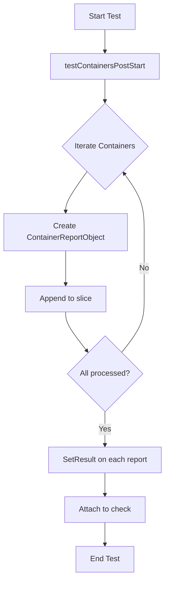

testContainersPostStart`

### Purpose
`testContainersPostStart` is a **private helper** used by the lifecycle test suite to verify that all containers in a pod (or set of pods) correctly execute their *post‑start* lifecycle hooks when the pod starts.

The function is invoked inside a Ginkgo test context, typically after the test environment has been provisioned and the target workload is running. It collects per‑container reports, aggregates them into a single result object, and records that result in the supplied `checksdb.Check`.

### Signature
```go
func testContainersPostStart(
    check *checksdb.Check,
    env  *provider.TestEnvironment,
) {}
```
| Parameter | Type                     | Role |
|-----------|--------------------------|------|
| `check`   | `*checksdb.Check`       | Holds the test definition and will store the final status. |
| `env`     | `*provider.TestEnvironment` | Provides access to the runtime environment (e.g., Kubernetes client, pod list). |

### Workflow
1. **Log start** – Emits an informational log indicating that post‑start checks are beginning.
2. **Iterate containers**  
   * For each container in the relevant pods:
     1. Create a new `ContainerReportObject` via `NewContainerReportObject`.  
        This object holds metadata (container name, pod name) and a field for status (`Result`, `Error`).
     2. Append the object to a slice that will be part of the final report.
3. **Log completion** – Emits an informational log once all containers have been processed.
4. **Aggregate results**  
   * Calls `SetResult()` on each `ContainerReportObject` to mark it as passed/failed (the actual evaluation logic is elsewhere; here we simply record the gathered status).
5. **Store outcome** – The aggregated slice of container reports is attached to the `check` object so that downstream reporting tools can consume it.

### Key Dependencies
| Dependency | Role |
|------------|------|
| `LogInfo`, `LogError` | Logging framework used by the test suite (likely Ginkgo/Go testing logs). |
| `NewContainerReportObject` | Factory for per‑container result objects. |
| `SetResult` | Marks a container report as successful or failed. |
| `append` | Standard Go slice operation to collect reports. |

### Side Effects
* **No mutation of the environment** – The function only reads pod/container information and writes results into the supplied `check`.  
* **Logging output** – Generates log entries for test visibility but does not alter state beyond that.

### Placement in the Package
`testContainersPostStart` lives in the `lifecycle` package, which implements the end‑to‑end tests for Kubernetes lifecycle hooks. It is one of several helper functions (e.g., `testContainersPreStop`, `testPodDeletion`) that encapsulate specific hook checks. The function is called from a Ginkgo test case after the pod has been created and started, ensuring that post‑start behavior can be asserted before moving on to subsequent lifecycle stages.

### Mermaid Diagram Suggestion


This diagram visualizes the linear flow from test initiation through container iteration, result aggregation, and final attachment to the `check` object.
