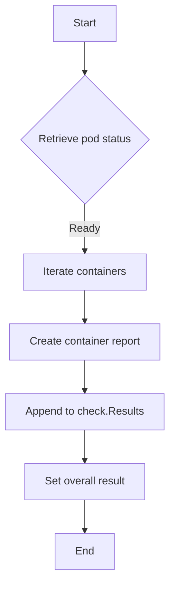

testContainersReadinessProbe` – *lifecycle package*

| Item | Description |
|------|-------------|
| **Purpose** | Verifies that the containers of a test pod expose a functional *readiness probe* by inspecting their status reports after the pod has been created and is running. |
| **Signature** | `func(*checksdb.Check, *provider.TestEnvironment)` |
| **Inputs** | • `check` – A database record describing the current check being performed. • `env` – The test environment that contains the Kubernetes client, logger, and other context needed to query pod status. |
| **Outputs** | None directly; the function records its result in the supplied `check`. |
| **Key Dependencies** | • `LogInfo`, `LogError` – Logging helpers from the surrounding test framework. • `NewContainerReportObject` – Helper that creates a container‑level report structure to be stored in the check’s result map. • `SetResult` – Stores the final status (pass/fail) on the check. |
| **Side‑Effects** | *Modifies* the supplied `check` by appending per‑container reports and setting the overall test outcome. No external state is altered. |
| **How it fits the package** | In the *lifecycle* test suite, each pod is created to validate its lifecycle behaviours (creation, deletion, restart). After a pod reaches the “Running” phase, `testContainersReadinessProbe` runs as part of the suite’s “afterEach” logic to ensure that **every container declares a readiness probe** and that Kubernetes reports it as ready. The outcome feeds into the final test report for the lifecycle check. |

## High‑level flow

1. **Log start** – The function logs that it is beginning the readiness probe test.
2. **Check pod status** – It pulls the current pod (from `env`) and verifies that all containers are reported as ready by Kubernetes.
3. **Generate reports** – For each container, a report object (`NewContainerReportObject`) is created with details such as name, image, and readiness state.
4. **Accumulate results** – These per‑container objects are appended to the `check`’s result slice.
5. **Set final status** – If any container fails the probe or the pod is not ready, `SetResult` marks the check as failed; otherwise it passes.
6. **Log completion** – The function logs success or error and returns.

## Usage notes

- The function assumes that the test environment (`env`) already contains a reference to the relevant pod; it does **not** query for pods itself.
- All state is captured inside the `check` argument, making the function pure with respect to external systems (aside from logging).
- It is intentionally non‑exported; only the lifecycle suite’s internal orchestration calls it.
