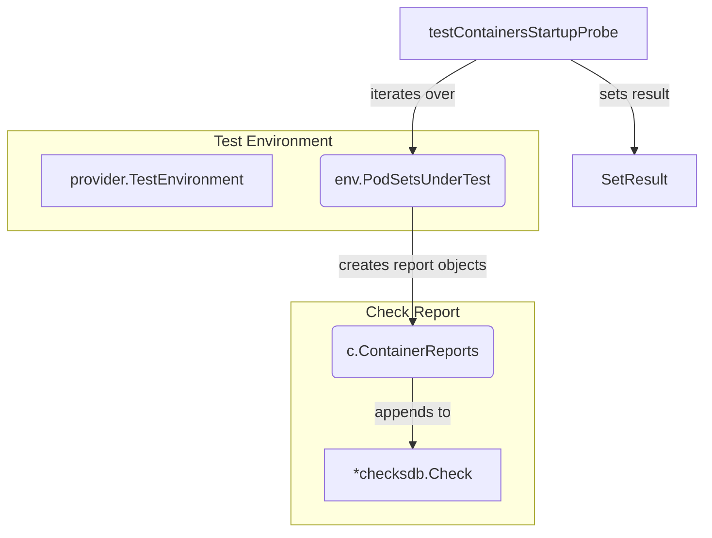

testContainersStartupProbe`

| Item | Description |
|------|-------------|
| **Signature** | `func(*checksdb.Check, *provider.TestEnvironment)` |
| **Visibility** | unexported – used only inside the `lifecycle` test suite |

### Purpose
`testContainersStartupProbe` is a helper that verifies whether each container in the pod set under test reports a successful **startup probe** status.  
It records the outcome of this check as part of the overall test report.

### Inputs

| Parameter | Type | Meaning |
|-----------|------|---------|
| `c` | `*checksdb.Check` | The test‑check object that holds metadata and will receive the result of this probe test. |
| `env` | `*provider.TestEnvironment` | Test environment providing access to the Kubernetes client, logging utilities, and a list of pod sets currently being evaluated. |

### Operation

1. **Logging start** – logs that the startup‑probe test is beginning.
2. **Iterate over pod sets** – for each pod set in `env.PodSetsUnderTest`:
   * Build a container report object (`NewContainerReportObject`) containing the pod set name and a list of containers.
   * Append this report to `c.ContainerReports`.
3. **Set result** – after processing all pod sets, mark the check as passed (`SetResult(c, checksdb.CheckPassed)`).
4. **Logging completion** – logs that the startup‑probe test finished.

### Key Dependencies

| Dependency | Role |
|------------|------|
| `LogInfo`, `LogError` | Structured logging for test progress and failures. |
| `NewContainerReportObject` | Creates a report entry for each pod set’s containers. |
| `SetResult` | Records the overall pass/fail status of the check. |

### Side Effects

* No state is mutated outside of the supplied `Check` object; it only appends to `c.ContainerReports`.
* No external resources are altered (no Kubernetes API calls in this snippet).

### Context within the Package

The `lifecycle` package orchestrates a series of tests that validate the health and lifecycle behavior of Kubernetes workloads.  
`testContainersStartupProbe` is one of several check functions invoked by the test harness to populate a comprehensive report (`checksdb.Check`). It ensures that startup probes are configured for all containers, which is critical for correct pod initialization semantics.

---

**Mermaid diagram (suggested)**

This diagram illustrates the flow from the test environment through each pod set, creating container reports, and finally updating the check status.
