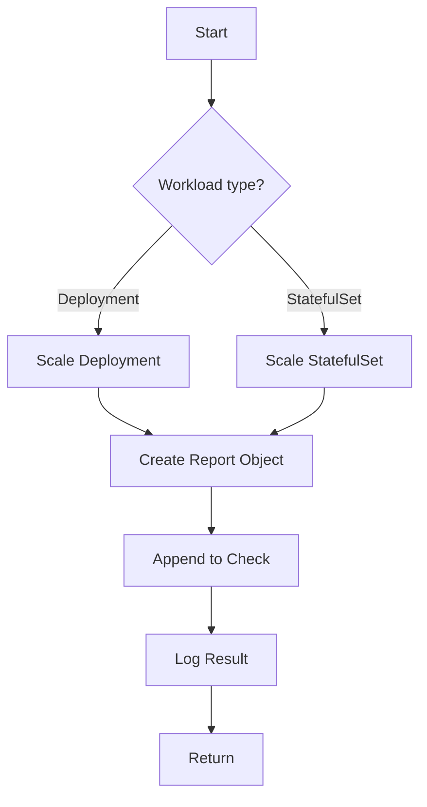

testHighAvailability`

> **Location:** `suite.go:524` – internal helper used by the lifecycle test suite  
> **Signature:** `func(*checksdb.Check, *provider.TestEnvironment)`

---

## Purpose

`testHighAvailability` verifies that a workload (either a Deployment or a StatefulSet) can be scaled up and down without losing data or service continuity.  
It runs through the following high‑level steps:

1. **Identify target workloads** – the function receives a `Check` object, which contains the IDs of the resources to test.
2. **Scale the workload** – it iteratively scales the number of replicas from 0 up to the configured maximum and back down again.
3. **Record metrics** – for each scale operation it creates either a *DeploymentReportObject* or *StatefulSetReportObject* (depending on the workload type) that captures:
   - The desired replica count
   - Whether the scaling succeeded (`SetResult(true/false)`)

4. **Log progress** – `LogInfo` and `LogError` are used to emit diagnostic messages, and `ToString` converts internal values into human‑readable strings.

5. **Return** – nothing is returned; all results are stored in the supplied `Check` via its result field.

---

## Inputs

| Parameter | Type | Role |
|-----------|------|------|
| `c *checksdb.Check` | A reference to a check record that will be updated with the test outcome. | Stores results of each scaling attempt. |
| `env *provider.TestEnvironment` | The test environment context (cluster connection, configuration). | Supplies utilities such as logging and resource accessors. |

---

## Outputs / Side‑Effects

* **Mutation of `c`** – Each successful or failed scale is appended to the check’s result slice via calls to:
  - `NewDeploymentReportObject` / `NewStatefulSetReportObject`
  - `SetResult`

* **Logging** – Human‑readable status messages are emitted through the environment’s logger.

* **No external state change** – The function does not alter any global variables or configuration; it only interacts with the provided check and environment objects.

---

## Key Dependencies

| Dependency | Role |
|------------|------|
| `LogInfo`, `LogError` | Output progress and error messages. |
| `ToString` | Convert internal structures (e.g., replica counts) to string form for logs. |
| `NewDeploymentReportObject`, `NewStatefulSetReportObject` | Create structured report entries that are appended to the check. |
| `append` | Add new report objects to a slice stored in the check. |
| `SetResult` | Mark each report entry as passed/failed. |

---

## How It Fits the Package

The **lifecycle** package implements end‑to‑end tests for Kubernetes workloads.  
`testHighAvailability` is one of several helper functions that orchestrate specific lifecycle checks (e.g., rolling updates, pod recreation).  
It is invoked by a higher‑level test runner which iterates over all configured checks in `suite.go`.  
By keeping the logic self‑contained and returning results only through the supplied `Check`, the function maintains clear separation of concerns: execution logic vs. result aggregation.

---

### Suggested Mermaid Flow (Optional)

---
