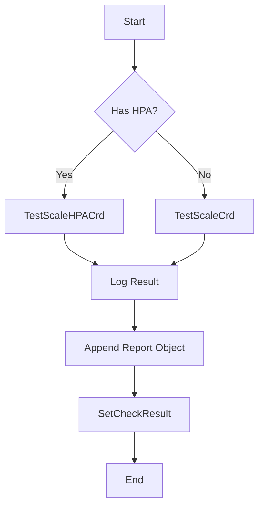

testScaleCrd`

```go
func testScaleCrd(env *provider.TestEnvironment,
                  timeout time.Duration,
                  check *checksdb.Check) func()
```

### Purpose
`testScaleCrd` builds a **lifecycle test function** that verifies the scaling behaviour of a custom resource definition (CRD).  
The returned closure is intended to be executed by the test runner (e.g. `ginkgo.It`).  
It performs the following high‑level steps:

1. **Mark the test as needing a refresh** – tells the environment that the CR will change state.
2. **Fetch the Horizontal Pod Autoscaler (HPA)** that corresponds to the target CR.
3. **Invoke the appropriate scaling routine** (`TestScaleHPACrd` or `TestScaleCrd`) based on whether an HPA is present.
4. **Log progress and errors**, creating a *CRD report object* for each step.
5. **Set the final test result** (success/failure) on the check record.

### Parameters

| Name | Type | Description |
|------|------|-------------|
| `env` | `*provider.TestEnvironment` | The execution environment that provides logging, state‑refresh helpers and access to the cluster. |
| `timeout` | `time.Duration` | Maximum duration for each scaling operation (passed to the underlying test functions). |
| `check` | `*checksdb.Check` | Database record describing the current check; used to record results and generate report objects. |

### Return Value

A **no‑argument closure** (`func()`) that, when invoked, runs the full scaling test and updates the supplied `check`.  
The closure has no return value because all side effects are applied directly to `env` and `check`.

### Key Dependencies & Side Effects

| Dependency | Role |
|------------|------|
| `SetNeedsRefresh()` | Flags the environment that a CR’s state will change, ensuring subsequent steps see the latest status. |
| `GetResourceHPA(env, check)` | Retrieves the HPA associated with the CR; determines which scaling routine to call. |
| `TestScaleHPACrd(...)` / `TestScaleCrd(...)` | Execute the actual scaling logic and return a boolean success flag. |
| `NewCrdReportObject()` | Builds a lightweight report entry that captures metrics (e.g., duration, status). These are appended to the check’s result list via `append`. |
| `GetLogger()` / `LogInfo()`, `LogError()` | Emit structured logs for debugging and traceability. |
| `SetResult(success)` | Stores the final boolean outcome in the `check` record. |

**Side effects**

* Modifies the supplied `check` by appending report objects and setting the result.
* Logs progress and errors to the test environment’s logger.
* Triggers a refresh of CR state in the environment.

### Package Context

The function lives in the `lifecycle` package, which contains integration tests for Kubernetes lifecycle scenarios.  
It is used by higher‑level suites that orchestrate scaling tests across multiple resources. The returned closure fits into the Ginkgo test flow as an **it‑block** body, ensuring each CR’s scaling behaviour is verified under a common timeout and with consistent reporting.

--- 

#### Suggested Mermaid diagram



This diagram illustrates the decision path and main actions performed by `testScaleCrd`.
