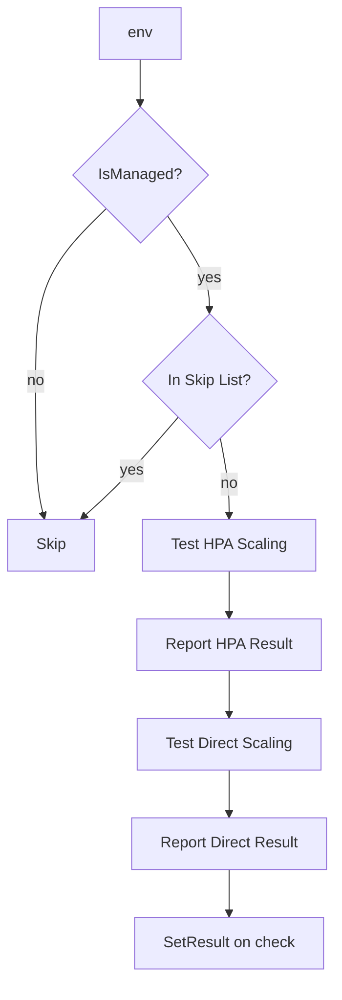

testStatefulSetScaling`

| Aspect | Detail |
|--------|--------|
| **Location** | `github.com/redhat-best-practices-for-k8s/certsuite/tests/lifecycle/suite.go:475` |
| **Signature** | `func(*provider.TestEnvironment, time.Duration, *checksdb.Check)() { ... }` |

### Purpose
The function returns a closure that performs the *StatefulSet scaling* test.  
When executed, the closure:

1. Refreshes the test environment state if needed (`SetNeedsRefresh`).  
2. Logs the start of the test and checks whether the targeted StatefulSet is managed by CertSuite.  
3. Verifies owner references to ensure the StatefulSet belongs to a Deployment or DaemonSet that CertSuite controls (`CheckOwnerReference`).  
4. If the StatefulSet is in the skip list, it logs an informational message and exits early.  
5. Otherwise it runs two sub‑tests:
   * **Horizontal Pod Autoscaler (HPA) scaling** – `TestScaleHpaStatefulSet`
   * **Direct scaling** – `TestScaleStatefulSet`

The results of each sub‑test are appended to a report object (`NewStatefulSetReportObject`) and finally the aggregated result is set on the supplied `*checksdb.Check` instance via `SetResult`.

### Inputs
| Parameter | Type | Description |
|-----------|------|-------------|
| `env` | `*provider.TestEnvironment` | The current test environment containing cluster client, logger, and other shared state. |
| `timeout` | `time.Duration` | Timeout for the scaling operations (used internally by sub‑tests). |
| `check` | `*checksdb.Check` | The check record that will receive the result of this test. |

### Output
The function returns a **closure** (`func()`) with no parameters and no return value.  
When called, the closure performs all operations described above and updates the supplied `check`.

### Key Dependencies & Side Effects

| Dependency | Role |
|------------|------|
| `SetNeedsRefresh` | Marks the environment as needing a refresh before running the test. |
| `LogInfo`, `LogError` | Emit informational or error logs via the environment’s logger. |
| `IsManaged`, `CheckOwnerReference`, `GetOwnerReferences` | Determine whether the StatefulSet is under CertSuite control and validate its ownership chain. |
| `nameInStatefulSetSkipList` | Checks if a particular StatefulSet should be skipped. |
| `TestScaleHpaStatefulSet`, `TestScaleStatefulSet` | Execute the actual scaling logic for HPA‑driven and direct scaling scenarios. |
| `NewStatefulSetReportObject` | Builds a structured report that is appended to the check’s results. |
| `SetResult` | Stores the final outcome (success/failure) on the `check`. |

### Integration with the Package
The `lifecycle` package orchestrates tests that validate Kubernetes resource lifecycle behavior.  
`testStatefulSetScaling` is one of several test generators in this package, each returning a closure that conforms to the common testing interface used by CertSuite’s orchestration layer (`suite.go`).  
It specifically targets StatefulSets, ensuring they can be scaled safely both via HPA and direct manual scaling while preserving ownership semantics.  

### Summary
`testStatefulSetScaling` encapsulates the logic for verifying that StatefulSets in a CertSuite‑managed cluster can be scaled correctly.  
It handles environment preparation, ownership validation, optional skipping, execution of two distinct scaling scenarios, and aggregation of results into a single `checksdb.Check`.
