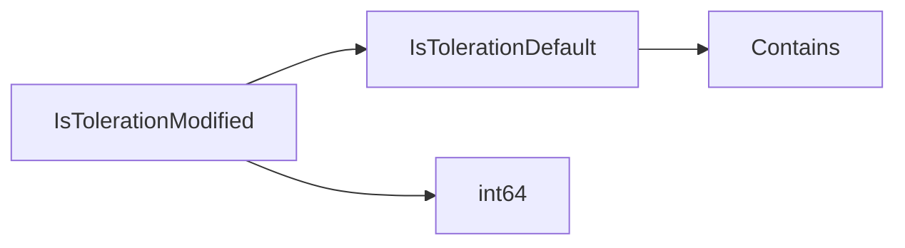

## Package tolerations (github.com/redhat-best-practices-for-k8s/certsuite/tests/lifecycle/tolerations)

### Functions

- **IsTolerationDefault** — func(corev1.Toleration)(bool)
- **IsTolerationModified** — func(corev1.Toleration, corev1.PodQOSClass)(bool)

### Globals

### Call graph (exported symbols, partial)

### Symbol docs

- [function IsTolerationDefault](symbols/function_IsTolerationDefault.md)
- [function IsTolerationModified](symbols/function_IsTolerationModified.md)
