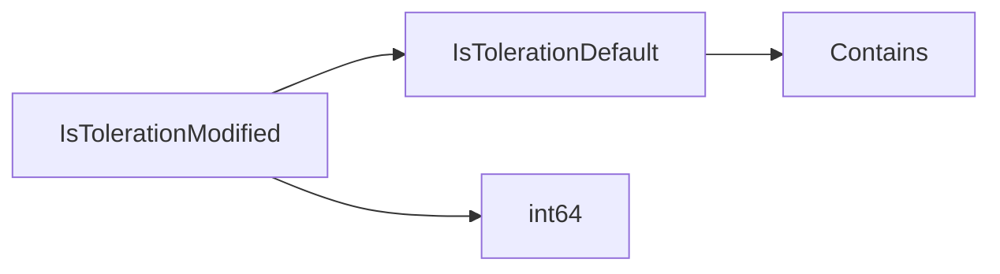

## Package tolerations (github.com/redhat-best-practices-for-k8s/certsuite/tests/lifecycle/tolerations)

## Package Overview – `tolerations`

The **`tolerations`** package is a small helper used by CertSuite’s lifecycle tests to determine whether a pod’s toleration configuration deviates from the expected “default” values.  
It focuses on two key predicates:

| Function | Purpose |
|----------|---------|
| `IsTolerationModified(t corev1.Toleration, qos corev1.PodQOSClass) bool` | Returns `true` if a toleration differs from its default for the pod’s QOS class. |
| `IsTolerationDefault(t corev1.Toleration) bool` | Checks whether a toleration matches the hard‑coded defaults. |

Both functions operate on Kubernetes **core v1** types (`corev1.Toleration`, `corev1.PodQOSClass`) and rely on two package‑level constants.

---

### Global Constants

| Name | Value | Role |
|------|-------|------|
| `nonCompliantTolerations` | `"node.kubernetes.io/unreachable,node.kubernetes.io/not-ready"` | A comma‑separated list of toleration keys that are *not* considered compliant. The helper uses this to filter out default “unreachable/not‑ready” tolerations that are automatically added by kubelet. |
| `tolerationSecondsDefault` | `int64(3600)` | Default value for the `TolerationSeconds` field when a pod does **not** specify one. A value of 1 hour is assumed if omitted. |

---

### Core Logic

#### 1. `IsTolerationModified`

```go
func IsTolerationModified(t corev1.Toleration, qos corev1.PodQOSClass) bool {
    // If the toleration matches the default for its QoS class → not modified.
    if IsTolerationDefault(t) {
        return false
    }

    // For BestEffort pods the default is always 0 (no tolerationSeconds).
    if qos == corev1.PodQOSBestEffort && t.TolerationSeconds == nil {
        return false
    }

    // All other cases are considered modified.
    return true
}
```

* **Default check** – Calls `IsTolerationDefault`.  
* **QoS special case** – Best‑Effort pods normally do not receive a default toleration; if the pod has no `TolerationSeconds` field, it is treated as unchanged.  
* **Fallback** – Any other situation is flagged as “modified”.

#### 2. `IsTolerationDefault`

```go
func IsTolerationDefault(t corev1.Toleration) bool {
    // Skip keys that are known to be automatically added by kubelet.
    if strings.Contains(nonCompliantTolerations, t.Key) {
        return false
    }

    // Default tolerationSeconds value (3600s).
    defaultSeconds := int64(3600)

    // Check the key/value pair against defaults:
    //   key == "node.kubernetes.io/not-ready" && operator == "Exists"
    //   key == "node.kubernetes.io/unreachable" && operator == "Exists"
    // and tolerationSeconds == defaultSeconds.
    return t.Key == "node.kubernetes.io/not-ready" &&
           t.Operator == corev1.TolerationOpExists &&
           *t.TolerationSeconds == defaultSeconds
}
```

* **Key filtering** – If the key is in `nonCompliantTolerations`, the toleration is automatically deemed non‑default.  
* **Default values** – The function expects a key of either `"node.kubernetes.io/not-ready"` or `"node.kubernetes.io/unreachable"`, an operator of `Exists`, and a `TolerationSeconds` equal to 3600 seconds.  
* **Return value** – `true` only when all conditions match; otherwise `false`.

---

### Typical Use Flow

```mermaid
flowchart TD
    A[Pod spec] --> B{Iterate tolerations}
    B -->|For each t| C[IsTolerationModified(t, pod.QOS)]
    C -- true --> D[Flag as modified]
    C -- false --> E[Ignore]
```

1. **Iteration** – Test code iterates over a pod’s tolerations.  
2. **Decision** – `IsTolerationModified` decides whether the toleration deviates from the default.  
3. **Outcome** – Modified tolerations are reported as non‑compliant by the test harness.

---

### Summary

* The package encapsulates *default toleration logic* for CertSuite’s lifecycle tests.  
* It exposes two predicates that together determine if a pod’s toleration configuration is compliant with the expected defaults.  
* The implementation is intentionally lightweight: it only handles the most common “unreachable/not‑ready” keys and their standard `TolerationSeconds` value, which aligns with kubelet’s default behaviour.

This structure allows tests to remain agnostic of the underlying Kubernetes runtime while still asserting that pods do not contain unexpected tolerations.

### Functions

- **IsTolerationDefault** — func(corev1.Toleration)(bool)
- **IsTolerationModified** — func(corev1.Toleration, corev1.PodQOSClass)(bool)

### Globals


### Call graph (exported symbols, partial)



### Symbol docs

- [function IsTolerationDefault](symbols/function_IsTolerationDefault.md)
- [function IsTolerationModified](symbols/function_IsTolerationModified.md)
