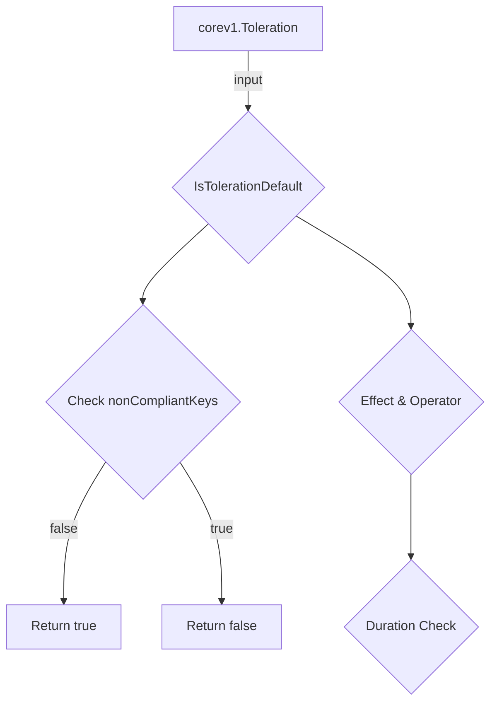

IsTolerationDefault` – Package *tolerations*

| Item | Description |
|------|-------------|
| **Package** | `github.com/redhat-best-practices-for-k8s/certsuite/tests/lifecycle/tolerations` |
| **File** | `tolerations.go` (line 90) |

## Purpose

`IsTolerationDefault` determines whether a Kubernetes toleration is considered *default* according to the CertSuite test logic.  
A “default” toleration means it will be automatically applied by the system or ignored when checking for non‑compliance. The function returns `true` if the supplied toleration matches one of the known default patterns, otherwise `false`.

## Signature

```go
func IsTolerationDefault(t corev1.Toleration) bool
```

* **Input** – a single `corev1.Toleration` object (from `k8s.io/api/core/v1`).
* **Output** – a boolean indicating default status.

## Dependencies & Internal Calls

| Dependency | Role |
|------------|------|
| `Contains` | Utility function that checks if a value exists in a slice. It is used to test the toleration’s key against the list of known non‑compliant keys (`nonCompliantTolerations`). |

The function relies on two package‑level constants defined earlier in the same file:

```go
var (
    nonCompliantTolerations = []string{"kubernetes.io/hostname", "node-role.kubernetes.io/master"}
    tolerationSecondsDefault = int64(3600) // default duration for certain tolerations
)
```

These values represent known “bad” keys that should not be tolerated by default.

## How It Works

1. **Key Check** – If the toleration’s key is in `nonCompliantTolerations`, the function immediately returns `false` (i.e., it is *not* a default toleration).
2. **Effect & Operator** – The function then checks:
   - Whether the toleration’s effect is `"NoSchedule"` or `"PreferNoSchedule"`.
   - Whether the operator is `"Exists"` and the value is empty.
3. **Duration Check** – For tolerations with `tolerationSeconds` set, it compares against `tolerationSecondsDefault`. If the duration differs from the default, it returns `false`.

If none of the above conditions are met, the function concludes that the toleration matches the “default” pattern and returns `true`.

## Side‑Effects & Mutability

* The function is **pure** – it reads only its argument and package constants; no global state is modified.
* It does not interact with external systems or APIs.

## Integration in the Package

`IsTolerationDefault` is used by higher‑level test functions that iterate over pod tolerations to filter out those that are implicitly added by Kubernetes. By identifying default tolerations, the tests can focus on user‑defined tolerations that might violate security best practices.

---

### Suggested Mermaid Diagram (Package View)



This diagram illustrates the decision flow inside `IsTolerationDefault`.
