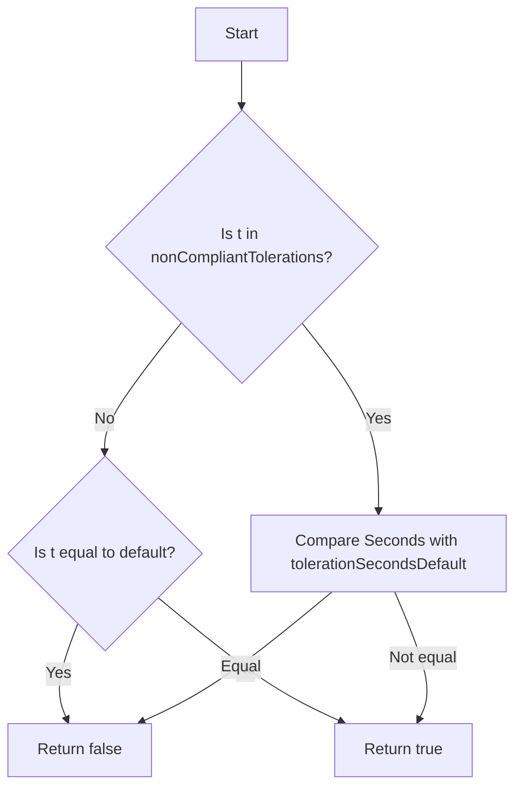

IsTolerationModified`

| Aspect | Detail |
|--------|--------|
| **Package** | `tolerations` (`github.com/redhat-best-practices-for-k8s/certsuite/tests/lifecycle/tolerations`) |
| **Exported?** | Yes – it is part of the public API for test helpers. |
| **Signature** | `func IsTolerationModified(t corev1.Toleration, qos corev1.PodQOSClass) bool` |

## Purpose

Determines whether a given Kubernetes pod toleration has been altered from its “default” configuration for the specified QoS class.

- **Use case**: In lifecycle tests, we want to assert that certain tolerations are *not* modified by operators or admission controllers.  
- **Behavior**: Returns `true` if the toleration differs from what is expected for the given QoS class; otherwise returns `false`.

## Parameters

| Name | Type | Description |
|------|------|-------------|
| `t` | `corev1.Toleration` | The toleration to evaluate. |
| `qos` | `corev1.PodQOSClass` | The QoS class of the pod (`BestEffort`, `Burstable`, or `Guaranteed`). |

## Return Value

- `bool`:  
  - `true` – toleration is *modified* (i.e., not equal to its default for the QoS).  
  - `false` – toleration matches the default.

## Key Dependencies

| Dependency | Role |
|------------|------|
| `IsTolerationDefault(t, qos)` | Helper that returns whether a toleration equals the default value for the given QoS. |
| `int64()` | Converts an integer literal to `*int64` when comparing numeric fields of the toleration (specifically the `Seconds` field). |

> **Note**: The function uses two package‑level variables defined earlier in the file:
> - `nonCompliantTolerations`: a slice of toleration keys that are not allowed to be modified.
> - `tolerationSecondsDefault`: the default value for the `Seconds` field (used when comparing with `int64()`).

## Algorithm Overview

1. **Check non‑compliant keys** – if the toleration’s key is in `nonCompliantTolerations`, the function still compares the `Seconds` field against the default to catch unintended changes.
2. **Default comparison** – otherwise, it delegates to `IsTolerationDefault`.
3. **Return** – `false` only when the toleration matches its expected default; any deviation yields `true`.

## Side Effects

- None. The function is purely functional: it reads inputs and returns a boolean without mutating state or affecting external systems.

## How It Fits the Package

The `tolerations` package provides utilities for testing pod lifecycle behavior, specifically around Kubernetes toleration rules.  
`IsTolerationModified` is used by test cases that need to assert whether an operator (e.g., a security context constraint enforcer) has inadvertently altered a toleration from its expected default. It complements:

- `IsTolerationDefault`: the inverse check.
- Other helpers that list or validate tolerations.

By keeping this logic isolated, tests can remain declarative and focused on outcomes rather than low‑level comparison details.
