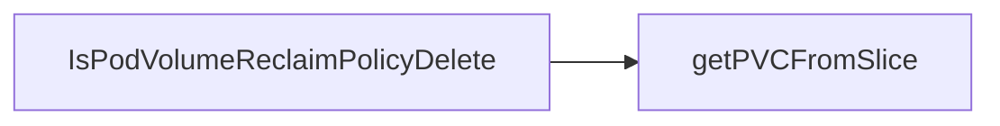

## Package volumes (github.com/redhat-best-practices-for-k8s/certsuite/tests/lifecycle/volumes)

### Functions

- **IsPodVolumeReclaimPolicyDelete** — func(*corev1.Volume, []corev1.PersistentVolume, []corev1.PersistentVolumeClaim)(bool)

### Call graph (exported symbols, partial)

### Symbol docs

- [function IsPodVolumeReclaimPolicyDelete](symbols/function_IsPodVolumeReclaimPolicyDelete.md)
