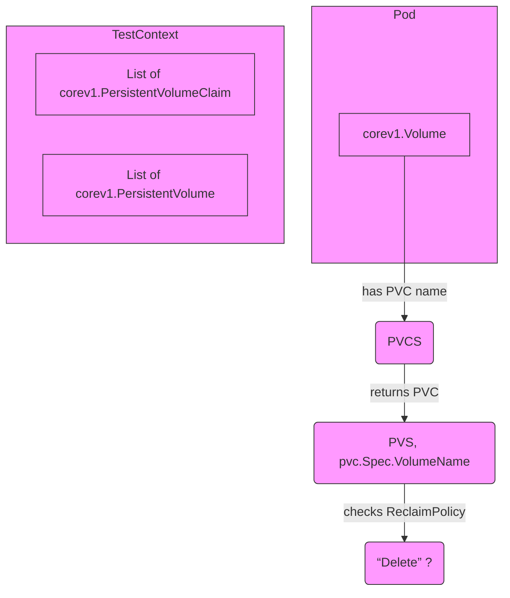
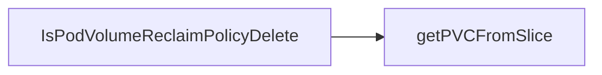

## Package volumes (github.com/redhat-best-practices-for-k8s/certsuite/tests/lifecycle/volumes)

## 📦 Package Overview – `github.com/redhat-best-practices-for-k8s/certsuite/tests/lifecycle/volumes`

| Aspect | Description |
|--------|-------------|
| **Purpose** | Utilities for inspecting Kubernetes pod volumes during lifecycle tests, specifically to determine whether a volume will be deleted when its owning pod is removed. |
| **Key Types Used** | - `corev1.Volume` (from `k8s.io/api/core/v1`) – represents a volume in a Pod spec. - `corev1.PersistentVolume` – the cluster‑wide PV object backing storage. - `corev1.PersistentVolumeClaim` – claim made by a pod to consume a PV. |
| **Main Functions** | 1. `IsPodVolumeReclaimPolicyDelete(v *corev1.Volume, pvs []corev1.PersistentVolume, pvcs []corev1.PersistentVolumeClaim) bool` 2. `getPVCFromSlice(pvcs []corev1.PersistentVolumeClaim, name string) *corev1.PersistentVolumeClaim` |

---

### 🔧 How the Functions Work

#### 1. `IsPodVolumeReclaimPolicyDelete`

| Step | What Happens |
|------|--------------|
| **Identify claim** | If the volume is a PVC (`v.VolumeSource.PersistentVolumeClaim != nil`), it extracts the claim name. |
| **Find the PVC object** | Calls `getPVCFromSlice(pvcs, claimName)` to retrieve the full `PersistentVolumeClaim`. |
| **Locate bound PV** | Once the PVC is found, its `Spec.VolumeName` holds the name of the backing `PersistentVolume`. The function then scans `pvs` for a PV with that name. |
| **Check reclaim policy** | If the PV’s `Spec.PersistentVolumeReclaimPolicy` equals `"Delete"`, the function returns `true`; otherwise `false`. |
| **Fallback** | If any lookup fails (no PVC or PV found, or not a Delete policy), it defaults to `false`. |

> **Use‑case** – During a lifecycle test you can call this helper to assert that a pod’s volume will be cleaned up automatically when the pod is deleted.

#### 2. `getPVCFromSlice`

| Parameter | Meaning |
|-----------|---------|
| `pvcs` | Slice of all PVCs in the namespace or cluster context. |
| `name` | Name of the PVC to locate. |

The function iterates over the slice and returns a pointer to the matching PVC, or `nil` if not found.

---

### 📊 Conceptual Flow (Mermaid)

---

### ⚙️ Dependencies

- **k8s.io/api/core/v1** – The package provides the Kubernetes API types used throughout the test code.

No global variables or constants are defined in this file; all state is passed explicitly through function arguments. This design keeps the helpers pure and easy to unit‑test.

---

### 📌 Summary

The `volumes` package supplies lightweight utilities that, given a pod volume and lists of PVs/PVCs, determine whether deleting the pod will trigger deletion of its underlying persistent storage. It does so by:

1. Resolving the PVC from the volume definition.
2. Finding the bound PV.
3. Inspecting the PV’s `ReclaimPolicy`.

These helpers are especially useful in automated lifecycle tests where cleanup behavior must be verified.

### Functions

- **IsPodVolumeReclaimPolicyDelete** — func(*corev1.Volume, []corev1.PersistentVolume, []corev1.PersistentVolumeClaim)(bool)

### Call graph (exported symbols, partial)

### Symbol docs

- [function IsPodVolumeReclaimPolicyDelete](symbols/function_IsPodVolumeReclaimPolicyDelete.md)
