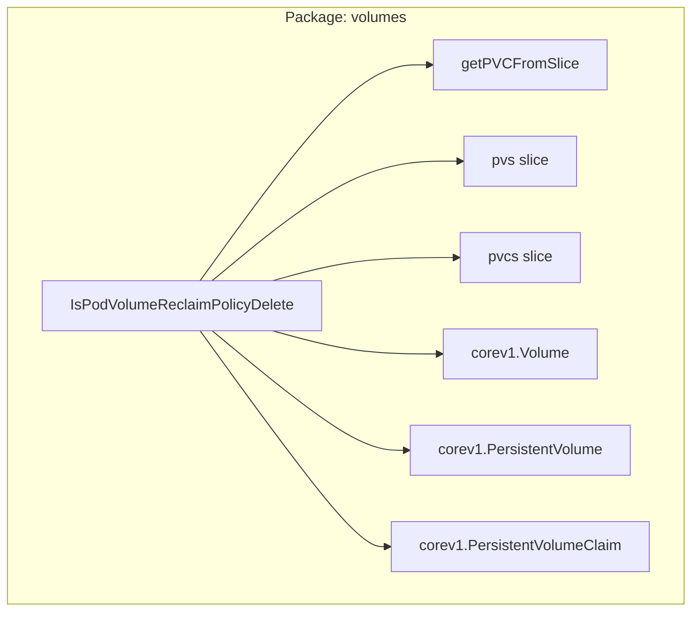

IsPodVolumeReclaimPolicyDelete`

**Package:** `github.com/redhat-best-practices-for-k8s/certsuite/tests/lifecycle/volumes`  
**Exported:** yes  

### Purpose
Determines whether a pod’s volume should be **deleted** after the pod is removed.  
The function inspects the *reclaim policy* of the backing PersistentVolume (PV) that backs a given `corev1.Volume`.  
If the PV’s reclaim policy is set to `Delete`, the corresponding PersistentVolumeClaim (PVC) can also be safely deleted, so the function returns `true`.

### Signature
```go
func IsPodVolumeReclaimPolicyDelete(
    vol *corev1.Volume,
    pvs []corev1.PersistentVolume,
    pvcs []corev1.PersistentVolumeClaim,
) bool
```

| Parameter | Type | Description |
|-----------|------|-------------|
| `vol` | `*corev1.Volume` | The volume object from a pod spec. Only the `PersistentVolumeClaimName` field is used. |
| `pvs` | `[]corev1.PersistentVolume` | Slice of all PVs in the cluster (or test namespace). |
| `pvcs` | `[]corev1.PersistentVolumeClaim` | Slice of all PVCs in the cluster (or test namespace). |

**Return value:**  
`true` if the volume’s backing PV has a reclaim policy of `Delete`; otherwise `false`.

### Key Dependencies
- **`getPVCFromSlice`** – helper that looks up a PVC by name inside the provided slice.  
  It is called to retrieve the PVC referenced by `vol.PersistentVolumeClaimName`.  
- Standard Kubernetes types (`corev1.Volume`, `corev1.PersistentVolume`, `corev1.PersistentVolumeClaim`).

### Workflow
1. **Validate input** – If `vol` is nil or its claim name empty, return `false`.
2. **Locate PVC** – Use `getPVCFromSlice(pvcs, vol.PersistentVolumeClaimName)` to find the owning PVC.
3. **Find PV** – Search through `pvs` for a PV whose `Spec.ClaimRef.Name` matches the PVC’s name.
4. **Check reclaim policy** – If that PV’s `Spec.PVCReclaimPolicy` equals `corev1.PersistentVolumeReclaimDelete`, return `true`; otherwise, `false`.

### Side Effects
None. The function performs read‑only lookups and returns a boolean.

### Role in the Package
Within the *volumes* test suite, this helper is used to decide whether volume cleanup logic should delete PV/PVC objects when a pod finishes. It encapsulates the policy lookup so that test cases can remain focused on higher‑level lifecycle behavior without duplicating reclaim‑policy logic.

---

#### Suggested Mermaid Diagram (package view)



This diagram highlights the function’s inputs, its helper call, and the Kubernetes types it manipulates.
