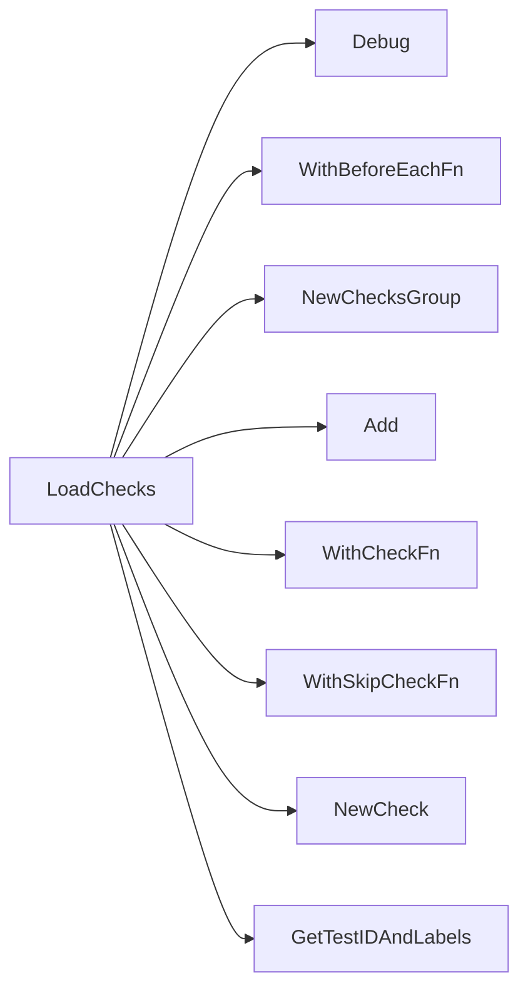

## Package manageability (github.com/redhat-best-practices-for-k8s/certsuite/tests/manageability)

# `manageability` Test Suite – Overview

The **manageability** package is a single‑file test suite that validates container configuration best‑practices for Kubernetes workloads.  
It focuses on two checks:

| Check | Purpose |
|-------|---------|
| **Containers image tag** | Ensures every container reference contains an explicit image tag (no `:latest` or missing tag). |
| **Container port name format** | Validates that each named port follows the partner‑convention `<protocol>[-<suffix>]`. |

The suite is built on top of CertSuite’s generic test framework (`checksdb`, `provider`, `testhelper`, etc.) and registers its checks during package init via `LoadChecks()`.

---

## Global state

| Variable | Type | Role |
|----------|------|------|
| `env` | `provider.TestEnvironment` | Holds the environment (K8s client, namespace, etc.) that all tests use. It is set in `beforeEachFn`. |
| `beforeEachFn` | `func()` | A function executed before each check; it initializes `env`. |
| `skipIfNoContainersFn` | `func(*checksdb.Check)` | Skips a check when the workload has no containers (used via `WithSkipCheckFn`). |
| `allowedProtocolNames` | `[]string` | List of allowed protocol prefixes for container port names (`grpc`, `http2`, etc.). |

> **Note** – The package contains only read‑only globals; they are never mutated after initialization.

---

## Core functions

### 1. `LoadChecks()`

```go
func LoadChecks() func()
```

*Registers the suite’s checks with CertSuite.*

- Calls `WithBeforeEachFn(beforeEachFn)` to set up per‑check environment.
- Creates a **group** named `"Manageability"` via `NewChecksGroup`.
- Adds two checks:
  - `"Containers image tag"`
    - Uses `testContainersImageTag` as the test function.
    - Skipped by `skipIfNoContainersFn`.
  - `"Container port name format"`
    - Uses `testContainerPortNameFormat` as the test function.
    - Skipped by `skipIfNoContainersFn`.

The returned closure is executed during suite initialization.

---

### 2. Check implementation helpers

#### a. `containerPortNameFormatCheck(name string) bool`

```go
func containerPortNameFormatCheck(name string) bool
```

- Splits the port name on `"-"`.
- The first segment must match one of `allowedProtocolNames`.  
- Returns `true` if valid, otherwise `false`.

#### b. `testContainersImageTag(c *checksdb.Check, env *provider.TestEnvironment)`

```go
func testContainersImageTag(c *checksdb.Check, env *provider.TestEnvironment)
```

1. Iterates over all containers in the workload.
2. Uses `IsTagEmpty(container.Image)` to detect missing tags.
3. Builds two lists:
   - **Compliant**: Containers with a tag.
   - **Non‑compliant**: Containers without a tag.
4. Reports each container via `NewContainerReportObject`.
5. Sets the overall result (`Pass` if no non‑compliant containers, otherwise `Fail`).

#### c. `testContainerPortNameFormat(c *checksdb.Check, env *provider.TestEnvironment)`

```go
func testContainerPortNameFormat(c *checksdb.Check, env *provider.TestEnvironment)
```

1. Iterates over all container ports.
2. Applies `containerPortNameFormatCheck` to each port name.
3. Builds compliant/non‑compliant lists similarly to the image‑tag check.
4. Reports each container and sets the final result.

---

## Flow diagram (Mermaid)

```mermaid
flowchart TD
  A[LoadChecks] --> B{BeforeEach}
  B --> C[Set env]
  A --> D[Create Group "Manageability"]
  D --> E[Add Check "Containers image tag"]
  E --> F[SkipIfNoContainers?]
  F --> G[testContainersImageTag]
  D --> H[Add Check "Container port name format"]
  H --> I[SkipIfNoContainers?]
  I --> J[testContainerPortNameFormat]
```

---

## Summary

- **Purpose**: Validate container image tags and port naming conventions.
- **Design**: A lightweight, single‑file test suite that registers two checks via `LoadChecks()`.
- **Execution**: Each check runs in the context of a shared `TestEnvironment`, reporting results per container.
- **Extensibility**: Adding new manageability tests would follow the same pattern—create a helper function and register it with `NewCheck`.

This package exemplifies how CertSuite orchestrates environment setup, skip logic, and detailed per‑object reporting within a concise test suite.

### Functions

- **LoadChecks** — func()()

### Globals


### Call graph (exported symbols, partial)



### Symbol docs

- [function LoadChecks](symbols/function_LoadChecks.md)
