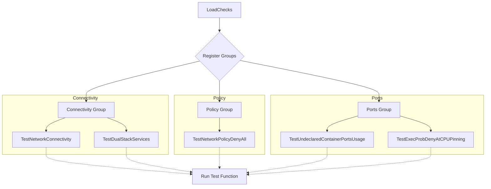
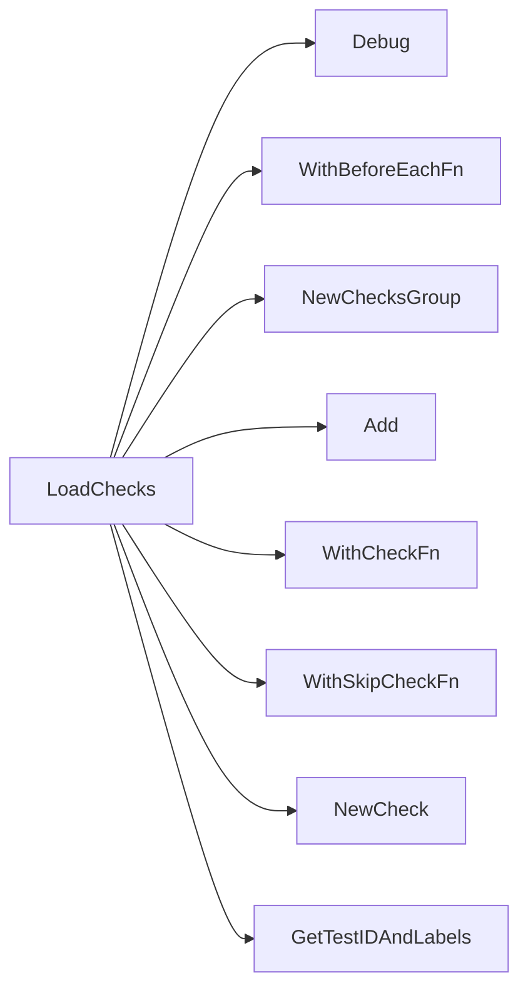

## Package networking (github.com/redhat-best-practices-for-k8s/certsuite/tests/networking)

## Networking Test Suite – High‑Level Overview

| Item | Type | Description |
|------|------|-------------|
| **Package** | `networking` | Collection of integration tests that validate Kubernetes networking behaviour (connectivity, policies, ports, etc.). |
| **Globals** | <ul><li>`env provider.TestEnvironment` – test harness holding cluster context.</li><li>`beforeEachFn func()` – hook executed before each check group.</li></ul> |
| **Constants** | `defaultNumPings int = 5`, `nodePort int = 30000` – default values used by connectivity tests. |

### Core Concepts

1. **Checks & CheckGroups**
   - A *check* represents a single test case (e.g., “validate network policy deny‑all”).  
   - Checks are organized into *groups* via `NewChecksGroup`.  
   - Each check has:
     - An identifier/label set (`GetTestIDAndLabels`).
     - Optional skip logic (`WithSkipCheckFn`) to ignore the test under specific cluster conditions.
     - The actual test function passed through `WithCheckFn`.

2. **Report Objects**
   - Tests generate structured results using *report objects*:
     - `NewReportObject()` – for cluster‑level outcomes (e.g., connectivity).
     - `NewPodReportObject(pod)` – per‑pod outcome, enriched with fields (`AddField`) and a type tag (`SetType`).

3. **Test Environment**
   - The global `env` holds the current test environment: Kubernetes client, namespace, node list, etc.
   - Helper functions such as `GetLogger()` or `RunNetworkingTests()` rely on this context.

### How Checks Are Loaded

The exported function `LoadChecks()` is called by the framework during initialization:

```go
func LoadChecks() func() {
    // 1. Hook to run before each group
    WithBeforeEachFn(beforeEachFn)

    // 2. Build groups of checks
    NewChecksGroup("Connectivity", func(g *checksdb.ChecksGroup) {
        g.Add(NewCheck("testNetworkConnectivity").
            WithSkipCheckFn(GetNoPodsUnderTestSkipFn).
            WithCheckFn(func(c *checksdb.Check, env *provider.TestEnvironment) {
                testNetworkConnectivity(env, netcommons.IPv4, netcommons.IFTypeDefault, c)
            }))
        // …more connectivity checks
    })

    // 3. Repeat for other groups (Policy, Ports, etc.)
}
```

The function returns a closure that the framework invokes to register all checks.

### Representative Check Implementations

| Function | Purpose | Key Steps |
|----------|---------|-----------|
| `testNetworkConnectivity` | Verify default interface reachability between pods. | 1. Build test context (`BuildNetTestContext`).<br>2. Run ping tests via `RunNetworkingTests`. <br>3. Log results and set status on the check. |
| `testDualStackServices` | Validate services exposing both IPv4/IPv6 addresses. | Iterate over services, call `GetServiceIPVersion`, build a report object per service, log success/failure. |
| `testNetworkPolicyDenyAll` | Ensure that a “deny‑all” NetworkPolicy blocks traffic from non‑labelled pods. | For each pod: <br>• Verify labels match the policy selector (`LabelsMatch`).<br>• Call `IsNetworkPolicyCompliant`. <br>• Record compliance per pod in a report object. |
| `testUndeclaredContainerPortsUsage` | Detect ports that are listening inside containers but not declared in the Pod spec. | 1. Gather all listening ports via `GetListeningPorts`.<br>2. Compare with container port declarations.<br>3. Create separate report objects for each discrepancy, flagging Istio proxies specially. |
| `testExecProbDenyAtCPUPinning` | Check that pods using exec probes are not CPU‑pinned. | Inspect each pod’s containers; if `HasExecProbes`, log and create a failure report. |
| `testNetworkAttachmentDefinitionSRIOVUsingMTU` | Ensure SR-IOV network attachments use the correct MTU. | Use `IsUsingSRIOVWithMTU`; record pass/fail per pod. |
| `testRestartOnRebootLabelOnPodsUsingSriov` | Verify that pods using SR‑IOV have a “restart‑on‑reboot” label. | Check labels via `GetLabels`, flag missing ones. |

### Flow of Execution

```
LoadChecks() → register groups
↓
Framework runs each group:
  beforeEachFn()
  For each check in group:
    if skip condition true → skip
    else → invoke WithCheckFn (test function)
          → perform test logic
          → create report objects
          → SetResult on the check
```

### Mermaid Diagram – Check Registration Flow



### Key Takeaways

- **Modularity** – Each check is a small, focused function that can be skipped conditionally.
- **Reporting** – Results are collected in structured objects for downstream consumption (e.g., dashboards).
- **Reusability** – Helper utilities (`netcommons`, `services`, `policies`) provide common networking logic across checks.

This overview should give you a solid mental model of how the networking test suite is assembled, executed, and reported.

### Functions

- **LoadChecks** — func()()

### Globals


### Call graph (exported symbols, partial)



### Symbol docs

- [function LoadChecks](symbols/function_LoadChecks.md)
