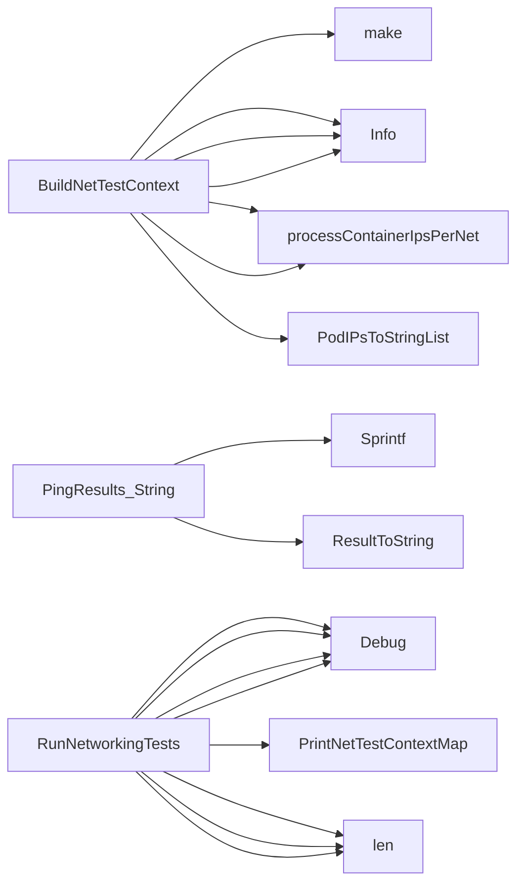

## Package icmp (github.com/redhat-best-practices-for-k8s/certsuite/tests/networking/icmp)

### Structs

- **PingResults** (exported) — 4 fields, 1 methods

### Functions

- **BuildNetTestContext** — func([]*provider.Pod, netcommons.IPVersion, netcommons.IFType, *log.Logger)(map[string]netcommons.NetTestContext)
- **PingResults.String** — func()(string)
- **RunNetworkingTests** — func(map[string]netcommons.NetTestContext, int, netcommons.IPVersion, *log.Logger)(testhelper.FailureReasonOut, bool)

### Globals

- **TestPing**: 

### Call graph (exported symbols, partial)

### Symbol docs

- [struct PingResults](symbols/struct_PingResults.md)
- [function BuildNetTestContext](symbols/function_BuildNetTestContext.md)
- [function PingResults.String](symbols/function_PingResults_String.md)
- [function RunNetworkingTests](symbols/function_RunNetworkingTests.md)
