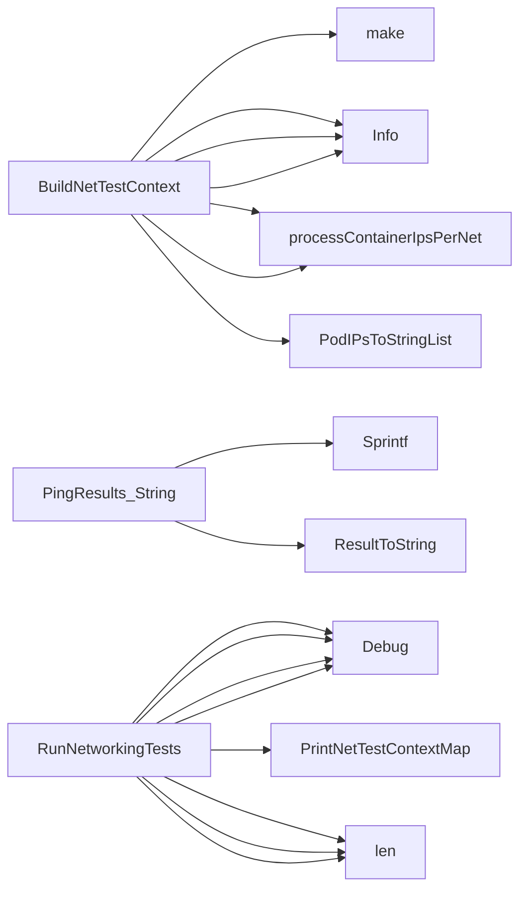

## Package icmp (github.com/redhat-best-practices-for-k8s/certsuite/tests/networking/icmp)

# icmp package – high‑level design

The `icmp` test suite is a small but self‑contained module that validates network connectivity between pods using ICMP ping.  
It lives under `tests/networking/icmp`, shares utilities with the broader networking tests, and relies on the **provider** abstraction to execute commands inside containers.

Below you’ll find a concise map of its core data structures, global state, key functions and how they interact.

---

## 1. Data Structures

| Name | Exported? | Purpose | Key fields |
|------|-----------|---------|------------|
| `PingResults` | ✅ | Holds the numeric summary that the Linux `ping` command outputs. | `errors`, `outcome`, `received`, `transmitted` |

### Methods
* `String() string`: Returns a human‑readable summary of a ping run, e.g. `"1/10 packets transmitted, 9 received (0% loss)"`.  
  It relies on the helper `ResultToString()` (not shown here) to format each metric.

---

## 2. Global Variables & Constants

| Name | Exported? | Type | Description |
|------|-----------|------|-------------|
| `TestPing` | ✅ | `func` | Public entry point for a single ping test: *source container* → *dest IP*, and vice‑versa. |
| `ConnectInvalidArgumentRegex` | ✅ | `string` | Regular expression that matches error messages from the `ping` command when an invalid address is supplied (e.g., “Unknown host”). |
| `SuccessfulOutputRegex` | ✅ | `string` | Regex that captures the numeric output line of a successful ping (`X packets transmitted, Y received`). |

---

## 3. Core Functions

### 3.1 `BuildNetTestContext`

```go
func BuildNetTestContext(
    pods []*provider.Pod,
    ipVer netcommons.IPVersion,
    ifType netcommons.IFType,
    log *log.Logger) map[string]netcommons.NetTestContext
```

* **Purpose** – Create a per‑network context (`NetTestContext`) that holds the IP addresses to target during ping tests.  
* **Process**
  1. Iterate over all pods, retrieving their network attachment interfaces.
  2. For each interface, gather container IPs via `processContainerIpsPerNet`.
  3. Build a map keyed by network name → `NetTestContext`.  
* **Outputs** – The caller can then feed this map into the test runner.

### 3.2 `RunNetworkingTests`

```go
func RunNetworkingTests(
    ctxMap map[string]netcommons.NetTestContext,
    timeout int,
    ipVer netcommons.IPVersion,
    log *log.Logger) (testhelper.FailureReasonOut, bool)
```

* **Purpose** – Execute ping tests across all networks in `ctxMap`.  
* **Workflow**
  1. Iterate over each network context.
  2. For every container inside the network, invoke `TestPing` against each target IP in that same context (but skip self‑pings).
  3. Collect results into a nested report structure (`NewContainerReportObject`, `NewReportObject`).  
* **Return** – A map of networks to failed targets and a boolean indicating overall success.

### 3.3 `TestPing`

```go
func TestPing(
    src *provider.Container,
    destIP string,
    ipVer netcommons.IPVersion,
    timeout int,
    log *log.Logger) (PingResults, error)
```

* **Purpose** – Run a single ping command from the source container to the destination IP.  
* **Implementation**
  1. Build the `ping` command line (`-c`, `-w`, optional `-I` for interface).
  2. Execute it inside the pod via `crclient.ExecContainer`.
  3. Parse stdout with `parsePingResult`.  
* **Return** – Parsed `PingResults` or an error.

### 3.4 `parsePingResult`

```go
func parsePingResult(stdout string, stderr string) (PingResults, error)
```

* **Purpose** – Convert the raw ping output into a structured `PingResults` value.  
* **Logic**
  * Use two regexes:
    * `SuccessfulOutputRegex` to capture packet statistics.
    * `ConnectInvalidArgumentRegex` to detect invalid host errors.
  * If success, convert captured strings → ints (`strconv.Atoi`).  
  * On error, return descriptive Go error.

### 3.5 `processContainerIpsPerNet`

```go
func processContainerIpsPerNet(
    container *provider.Container,
    netName string,
    ips []string,
    iface string,
    ctxMap map[string]netcommons.NetTestContext,
    ipVer netcommons.IPVersion,
    log *log.Logger) ()
```

* **Purpose** – Populate the test context for a specific network attachment of a pod.  
* **Steps**
  1. Filter `ips` to match the requested IP version (`FilterIPListByIPVersion`).
  2. Store the container and its filtered IP list in `ctxMap[netName]`.  
* **Side‑effect** – Adds entries to the shared context map that later drives the ping tests.

---

## 4. How It All Connects

```
+-------------------+
| BuildNetTestContext|
+----------+--------+
           |
           v
   NetTestContext map (network → container + target IPs)
           |
           v
    RunNetworkingTests
           |
   +-------+---------+
   |                 |
 TestPing  TestPing  ...  // per container / target pair
   |                 |
   v                 v
parsePingResult ----> PingResults
```

1. **Context construction** – `BuildNetTestContext` gathers every pod’s IPs per network and stores them in a map.  
2. **Execution** – `RunNetworkingTests` iterates that map, spawning a `TestPing` for each source‑destination pair (excluding self).  
3. **Result handling** – Each ping output is parsed; failures are recorded into a nested report hierarchy.

---

## 5. Suggested Mermaid Diagram

```mermaid
flowchart TD
    A[Pods] --> B[BuildNetTestContext]
    B --> C{NetName→Context}
    C --> D[RunNetworkingTests]
    D --> E[TestPing (src → dst)]
    E --> F[parsePingResult]
    F --> G[PingResults]
```

---

### Final Remarks

* The package is **read‑only** – it only constructs test contexts and invokes existing infrastructure (`crclient`, `log`).  
* All networking logic is encapsulated in the helper functions; no external state is mutated beyond the context map.  
* Error handling relies on regex matching of ping output, which keeps parsing simple but brittle to upstream changes.

This overview should give you a clear mental model of how the icmp test suite orchestrates container‑to‑container connectivity checks within a Kubernetes cluster.

### Structs

- **PingResults** (exported) — 4 fields, 1 methods

### Functions

- **BuildNetTestContext** — func([]*provider.Pod, netcommons.IPVersion, netcommons.IFType, *log.Logger)(map[string]netcommons.NetTestContext)
- **PingResults.String** — func()(string)
- **RunNetworkingTests** — func(map[string]netcommons.NetTestContext, int, netcommons.IPVersion, *log.Logger)(testhelper.FailureReasonOut, bool)

### Globals

- **TestPing**: 

### Call graph (exported symbols, partial)



### Symbol docs

- [struct PingResults](symbols/struct_PingResults.md)
- [function BuildNetTestContext](symbols/function_BuildNetTestContext.md)
- [function PingResults.String](symbols/function_PingResults_String.md)
- [function RunNetworkingTests](symbols/function_RunNetworkingTests.md)
