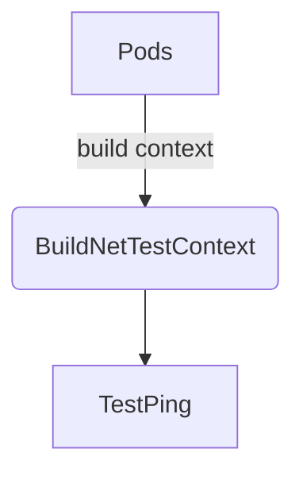

BuildNetTestContext`

| Feature | Details |
|---------|---------|
| **Package** | `icmp` (`github.com/redhat-best-practices-for-k8s/certsuite/tests/networking/icmp`) |
| **Signature** | `func BuildNetTestContext(pods []*provider.Pod, ipVer netcommons.IPVersion, ifType netcommons.IFType, logger *log.Logger) map[string]netcommons.NetTestContext` |
| **Exported** | Yes |

### Purpose
Builds a mapping of network‑test contexts for all pods that need to be involved in an ICMP (ping) test.  
Each key is the pod’s name and the value contains the container IP addresses, interface type, and IP version required for the ping operation.

### Parameters

| Name | Type | Role |
|------|------|------|
| `pods` | `[]*provider.Pod` | The list of pods that will be part of the test. Each pod may have one or more containers with network interfaces. |
| `ipVer` | `netcommons.IPVersion` | Indicates whether the test should use IPv4, IPv6, or both. |
| `ifType` | `netcommons.IFType` | Specifies the type of interface (e.g., `eth0`, `ib`) to be used for pinging. |
| `logger` | `*log.Logger` | Used only for debug output; does not modify state. |

### Return Value

- **Map** – key: pod name (`string`), value: `netcommons.NetTestContext`.
  Each `NetTestContext` contains the container IPs (already resolved to strings) and metadata needed by other test functions such as `processContainerIpsPerNet`.

### Key Steps & Dependencies

1. **Allocate result map**  
   ```go
   ctxMap := make(map[string]netcommons.NetTestContext)
   ```
2. **Iterate over pods** – For each pod:
   - Log the pod name (`logger.Info(...)`).
   - Resolve IP addresses per network interface via `processContainerIpsPerNet`.
     * This helper returns a slice of strings for container IPs that match the requested `ifType` and `ipVer`.
   - Convert the returned IP structs to string list with `PodIPsToStringList`.
3. **Populate context** – Store the resolved IP list into `ctxMap[pod.Name]`.

The function depends on:
- **Provider types** (`provider.Pod`) for pod data.
- **NetCommons helpers** (`processContainerIpsPerNet`, `PodIPsToStringList`).
- **Logging** via the passed `*log.Logger`.

### Side Effects

- Only logs information; no mutation of pods or global state.
- Builds and returns a new map; original input slice remains unchanged.

### How It Fits in the Package

The ICMP test suite requires knowledge of which IP addresses belong to each pod.  
`BuildNetTestContext` centralises that logic so other tests (e.g., `TestPing`) can:

1. Retrieve source/destination contexts from the map.
2. Feed those into ping commands or network‑level assertions.



> **Note:** The function is intentionally read‑only; it merely prepares data for downstream test execution.
