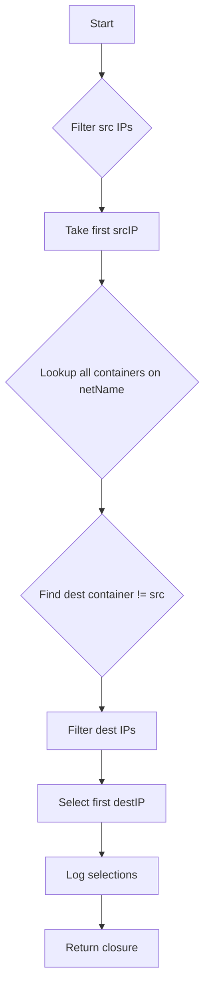

processContainerIpsPerNet`

`processContainerIpsPerNet` is an internal helper that prepares the data needed for a ping test between two containers that share (or are attached to) a particular network.  
The function does **not** perform any networking itself – it merely selects the source/target IPs, logs the decision, and returns a closure that will later be executed by `TestPing`.

| Section | Description |
|---------|-------------|
| **Signature** | `func(*provider.Container, string, []string, string, map[string]netcommons.NetTestContext, netcommons.IPVersion, *log.Logger)()`. |
| **Purpose** | For a given container (`src`), network attachment name (`netName`), and list of IPs belonging to that network (`ips`), pick the first IP as the source target. Then choose another container from `allContainerIPsPerNet[netName]` (if any) as the destination, filtering both lists by the supplied IP version. |
| **Inputs** | - `src *provider.Container`: the container that will act as the ping initiator.<br>- `netName string`: name of the network attachment being tested.<br>- `ips []string`: all IP addresses of `src` on this network.<br>- `netNameWithIdx string`: a key used for logging (often `"net0"` etc.).<br>- `allContainerIPsPerNet map[string]netcommons.NetTestContext`: mapping from network name to context that contains the list of containers and their IPs on that network.<br>- `ipVersion netcommons.IPVersion`: either IPv4 or IPv6; used to filter addresses.<br>- `logger *log.Logger`: logger for debug output. |
| **Outputs** | Returns a closure `func()` that, when called, will invoke `TestPing` with the chosen source/destination IPs and network context. The closure is intended to be scheduled by the test harness (e.g., via `go func(){...}()`). |
| **Key Dependencies** | - `FilterIPListByIPVersion`: trims an IP list to only those matching the supplied version.<br>- `netcommons.NetTestContext`: holds container IPs and other context for a network. |
| **Side‑effects** | • Logs which IPs were chosen as source/destination via `logger.Debug`. <br>• No state is mutated; all operations are read‑only on the inputs. |
| **How it fits the package** | The icmp test suite runs ping tests between containers that belong to a particular network attachment. For each container, `processContainerIpsPerNet` creates a target pair (source IP → destination IP) and returns a function that will later perform the actual ping via `TestPing`. This separation keeps the data‑preparation logic distinct from the networking code, enabling easier unit testing of the selection algorithm. |

### Flow diagram (Mermaid)



### Usage Example

```go
closure := processContainerIpsPerNet(
    src,
    netName,
    srcIPs,
    fmt.Sprintf("%s_%d", netName, idx),
    allContainerIPsPerNet,
    ipVer,
    logger,
)
go closure() // executes the ping test asynchronously
```

In this example `src` is the initiator container; `closure()` will later call `TestPing(srcIP, dstIP, ...)`.
