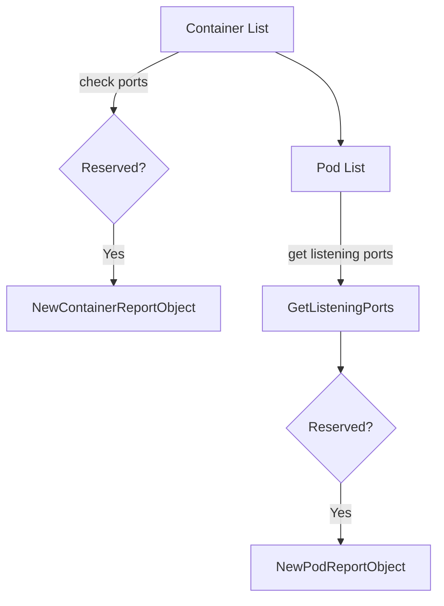
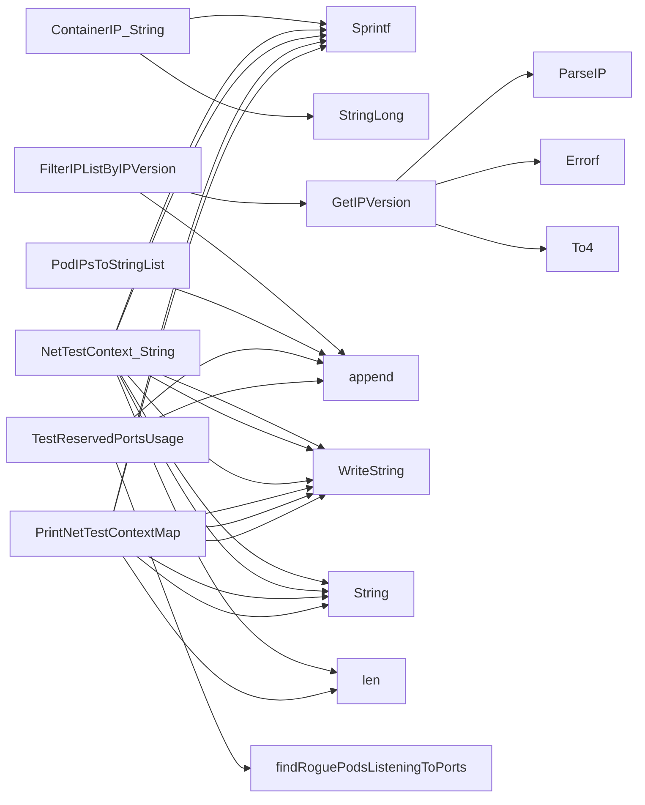

## Package netcommons (github.com/redhat-best-practices-for-k8s/certsuite/tests/networking/netcommons)

# `netcommons` – Networking Test Utilities

The **`netcommons`** package lives under  
`github.com/redhat-best-practices-for-k8s/certsuite/tests/networking/netcommons`.  
It contains helper types and functions that are reused by networking tests in the
CertSuite project.  The code is read‑only – no test logic, only data‑handling,
formatting, and small helper routines.

---

## Key Data Structures

| Type | Purpose | Fields |
|------|---------|--------|
| `ContainerIP` | Represents a container together with an IP that it uses for ping tests. | `ContainerIdentifier *provider.Container` – the container meta<br>`IP string` – the actual IP address (IPv4 or IPv6)<br>`InterfaceName string` – network interface name |
| `NetTestContext` | Holds all information required to run a ping test on a particular subnet / network attachment. | `TesterSource ContainerIP` – the container that initiates pings (selected as the first container in the list)<br>`DestTargets []ContainerIP` – list of other containers reachable from the tester<br>`TesterContainerNodeName string` – node name where the tester runs |

Both structs expose a `String()` method for pretty printing.

---

## IP‑Version Handling

```go
type IPVersion int
const (
    Undefined IPVersion = iota // 0
    IPv4                       // 1
    IPv6                       // 2
)
```

* **`GetIPVersion(ip string) (IPVersion, error)`**  
  Parses a string with `net.ParseIP`. If the result’s `To4()` is non‑nil,
  it returns `IPv4`, otherwise `IPv6`. Any parsing error is wrapped.

* **`FilterIPListByIPVersion(ips []string, v IPVersion) []string`**  
  Returns only those strings that match the requested version by calling
  `GetIPVersion` on each element.

The package also defines string constants for convenience:
`IPv4String`, `IPv6String`, `IPv4v6String`, and an `UndefinedString`.

---

## Container / Pod IP Helpers

| Function | Signature | What it does |
|----------|-----------|--------------|
| `PodIPsToStringList([]corev1.PodIP) []string` | converts a slice of `corev1.PodIP` into a string list (extracting the `IP` field). |
| `PrintNetTestContextMap(map[string]NetTestContext) string` | Builds a multi‑line, human readable representation of all test contexts. Uses the `String()` methods of both structs. |

---

## Reserved Port Checks

The package contains logic to detect “rogue” containers or pods that expose
ports reserved for Istio or other privileged components.

### Globals

```go
var ReservedIstioPorts map[int32]bool // exported, but set elsewhere in the tests
```

### Core Functions

| Function | Purpose |
|----------|---------|
| `findRogueContainersDeclaringPorts(containers []*provider.Container, ports map[int32]bool, ns string, log *log.Logger) [] *testhelper.ReportObject` | Iterates over containers. If any declared port matches a reserved one, creates a report object (`NewContainerReportObject`). |
| `findRoguePodsListeningToPorts(pods []*provider.Pod, ports map[int32]bool, ns string, log *log.Logger) [] *testhelper.ReportObject` | For each pod, obtains its listening ports via `GetListeningPorts`. If any match a reserved port, creates a report object (`NewPodReportObject`). It also skips Istio‑proxy pods (checked with `ContainsIstioProxy`). |
| `TestReservedPortsUsage(env *provider.TestEnvironment, reserved map[int32]bool, ns string, log *log.Logger) []*testhelper.ReportObject` | Public wrapper that runs both container and pod checks and aggregates the reports. |

All report objects are built with the helper package `testhelper`. They carry
fields such as `"container"`, `"pod"`, `"port"`, and a type tag.

---

## Flow Diagram (Mermaid)



The `TestReservedPortsUsage` function orchestrates the two checks and returns
the combined slice of report objects.

---

## Summary

* **Data** – `ContainerIP` & `NetTestContext` encapsulate networking test state.  
* **IP utilities** – helpers for parsing, filtering, and stringifying IPs.  
* **Reporting** – small utilities to detect containers/pods exposing reserved
  ports (e.g., Istio) and produce structured report objects.

These pieces are lightweight and used across multiple networking tests,
providing consistent data handling and reporting behaviour.

### Structs

- **ContainerIP** (exported) — 3 fields, 1 methods
- **NetTestContext** (exported) — 3 fields, 1 methods

### Functions

- **ContainerIP.String** — func()(string)
- **FilterIPListByIPVersion** — func([]string, IPVersion)([]string)
- **GetIPVersion** — func(string)(IPVersion, error)
- **IPVersion.String** — func()(string)
- **NetTestContext.String** — func()(string)
- **PodIPsToStringList** — func([]corev1.PodIP)([]string)
- **PrintNetTestContextMap** — func(map[string]NetTestContext)(string)
- **TestReservedPortsUsage** — func(*provider.TestEnvironment, map[int32]bool, string, *log.Logger)([]*testhelper.ReportObject)

### Globals

- **ReservedIstioPorts**: 

### Call graph (exported symbols, partial)



### Symbol docs

- [struct ContainerIP](symbols/struct_ContainerIP.md)
- [struct NetTestContext](symbols/struct_NetTestContext.md)
- [function ContainerIP.String](symbols/function_ContainerIP_String.md)
- [function FilterIPListByIPVersion](symbols/function_FilterIPListByIPVersion.md)
- [function GetIPVersion](symbols/function_GetIPVersion.md)
- [function IPVersion.String](symbols/function_IPVersion_String.md)
- [function NetTestContext.String](symbols/function_NetTestContext_String.md)
- [function PodIPsToStringList](symbols/function_PodIPsToStringList.md)
- [function PrintNetTestContextMap](symbols/function_PrintNetTestContextMap.md)
- [function TestReservedPortsUsage](symbols/function_TestReservedPortsUsage.md)
