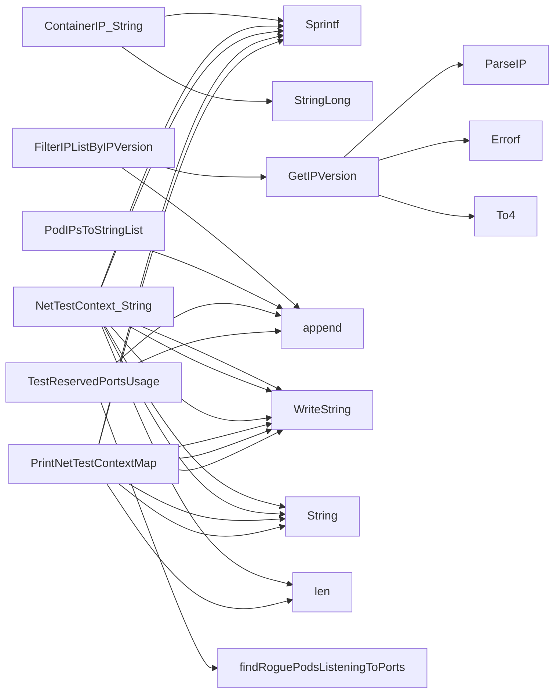

## Package netcommons (github.com/redhat-best-practices-for-k8s/certsuite/tests/networking/netcommons)

### Structs

- **ContainerIP** (exported) — 3 fields, 1 methods
- **NetTestContext** (exported) — 3 fields, 1 methods

### Functions

- **ContainerIP.String** — func()(string)
- **FilterIPListByIPVersion** — func([]string, IPVersion)([]string)
- **GetIPVersion** — func(string)(IPVersion, error)
- **IPVersion.String** — func()(string)
- **NetTestContext.String** — func()(string)
- **PodIPsToStringList** — func([]corev1.PodIP)([]string)
- **PrintNetTestContextMap** — func(map[string]NetTestContext)(string)
- **TestReservedPortsUsage** — func(*provider.TestEnvironment, map[int32]bool, string, *log.Logger)([]*testhelper.ReportObject)

### Globals

- **ReservedIstioPorts**: 

### Call graph (exported symbols, partial)

### Symbol docs

- [struct ContainerIP](symbols/struct_ContainerIP.md)
- [struct NetTestContext](symbols/struct_NetTestContext.md)
- [function ContainerIP.String](symbols/function_ContainerIP_String.md)
- [function FilterIPListByIPVersion](symbols/function_FilterIPListByIPVersion.md)
- [function GetIPVersion](symbols/function_GetIPVersion.md)
- [function IPVersion.String](symbols/function_IPVersion_String.md)
- [function NetTestContext.String](symbols/function_NetTestContext_String.md)
- [function PodIPsToStringList](symbols/function_PodIPsToStringList.md)
- [function PrintNetTestContextMap](symbols/function_PrintNetTestContextMap.md)
- [function TestReservedPortsUsage](symbols/function_TestReservedPortsUsage.md)
