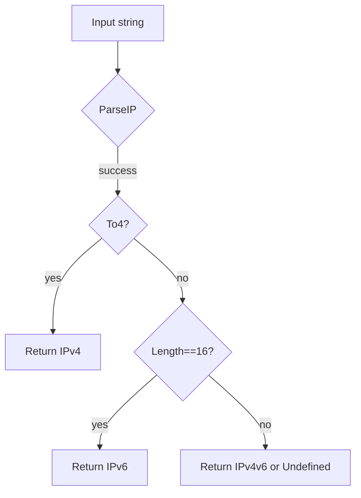

GetIPVersion`

| Aspect | Detail |
|--------|--------|
| **Signature** | `func GetIPVersion(ipStr string) (IPVersion, error)` |
| **Package** | `netcommons` – helper utilities for networking tests. |

### Purpose
Parses a dotted‑decimal or bracketed IPv6 address supplied as a string and returns the IP version (`IPv4`, `IPv6`, or `IPv4v6`) defined in the package’s `IPVersion` enum.  
It is used by test helpers that need to assert the protocol family of addresses they receive from the cluster or from configuration files.

### Inputs
* `ipStr` – a string representation of an IP address (e.g., `"10.0.0.1"` or `"2001:db8::1"`).  
  If the string is empty or not a valid IP, the function signals an error.

### Outputs
* **IPVersion** – one of the exported constants:
  * `IPv4`   – IPv4 address only.
  * `IPv6`   – IPv6 address only.
  * `IPv4v6` – an address that contains both families (e.g., `"::ffff:10.0.0.1"`).
* **error** – non‑nil if the input cannot be parsed as a valid IP or does not match any known version.

### Key Dependencies
| Called function | Role |
|-----------------|------|
| `ParseIP`       | Converts the string into an `net.IP`. |
| `To4`           | Detects whether the parsed IP is IPv4 (or an IPv4‑mapped IPv6). |
| `Errorf`        | Constructs error messages for invalid inputs. |

### Algorithm
1. **Parse** the input with `net.ParseIP`.  
   *If parsing fails, return `(Undefined, err)`*.
2. **Check IPv4**: `ip.To4()` returns non‑nil → `IPv4`.
3. **Check IPv6**: if length is 16 bytes → `IPv6`.
4. **Mixed case** (both IPv4 and IPv6 bits present) → `IPv4v6`.  
5. Fallback to `Undefined` for unexpected shapes.

### Side Effects
* No global state or side‑effects; pure function.
* The only runtime cost is the allocation of a temporary `net.IP`.

### Usage in Package
`GetIPVersion` is called by higher‑level test functions that:
* Validate that services expose expected IP families.
* Dynamically choose network configurations based on address types.

```go
ver, err := netcommons.GetIPVersion(node.Address)
if err != nil {
    t.Fatalf("invalid node address: %v", err)
}
switch ver {
case netcommons.IPv4:
    // handle IPv4‑only logic
case netcommons.IPv6:
    // handle IPv6‑only logic
case netcommons.IPv4v6:
    // handle dual‑stack nodes
default:
    t.Fatalf("unknown IP version")
}
```

### Diagram (optional)



This concise function is a foundational building block for networking tests, ensuring consistent interpretation of IP addresses across the test suite.
