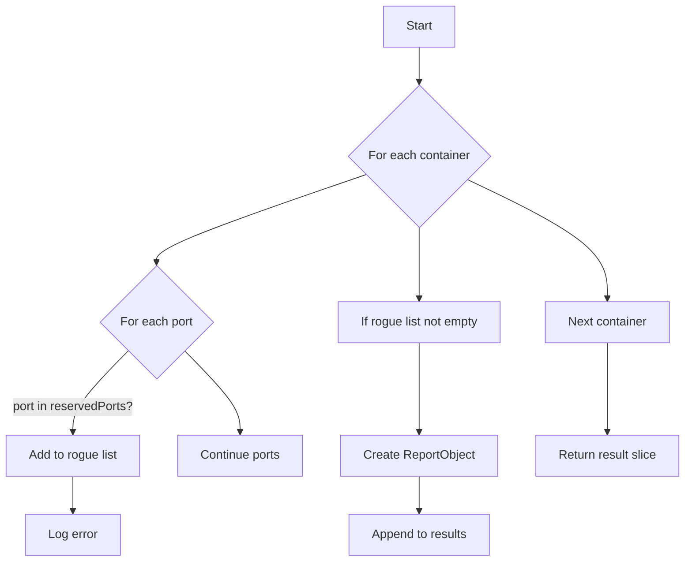

findRogueContainersDeclaringPorts`

**Location**

```go
// github.com/redhat-best-practices-for-k8s/certsuite/tests/networking/netcommons
func findRogueContainersDeclaringPorts(
    containers []*provider.Container,
    reservedPorts map[int32]bool,
    networkName string,
    logger *log.Logger,
) []*testhelper.ReportObject
```

---

### Purpose
Detect **rogue** containers that are exposing network ports which should be reserved for system components (e.g., Istio).  
A rogue container is one that declares a port in its `Ports` list that exists in the global `ReservedIstioPorts` map.  
The function returns a slice of `ReportObject`s – one per offending container – summarizing the conflict.

### Parameters

| Name | Type | Role |
|------|------|------|
| `containers` | `[]*provider.Container` | All containers discovered in the current test context. Each has a `Ports` field (list of port objects). |
| `reservedPorts` | `map[int32]bool` | A lookup table of ports that are reserved for Istio or other system components. Keys are port numbers, values are ignored (`true`). |
| `networkName` | `string` | The name of the network under inspection (used in log messages). |
| `logger` | `*log.Logger` | Logger used to emit informational and error messages during analysis. |

### Returns

- `[]*testhelper.ReportObject`:  
  Each element represents a container that declared at least one reserved port.  
  The object contains:
  * **Type**: `"Container"`
  * **Name**: the container’s name
  * **Fields**:
    - `Network` – the network name
    - `Ports` – a comma‑separated string of offending port numbers

### Key Logic Steps

1. **Iterate over containers**  
   For every container, inspect each declared port.

2. **Port validation**  
   * If the port number is present in `reservedPorts`, it’s considered rogue.
   * The function logs a warning via `logger.Error` and records the offending port.

3. **Report construction**  
   After scanning all ports of a container:
   * If any reserved ports were found, create a new report object (`NewContainerReportObject`) with relevant fields added using `AddField`.
   * Append this object to the result slice.

4. **Return results** – The final slice is returned to the caller for further aggregation or test failure handling.

### Dependencies & Side‑Effects

| Dependency | Effect |
|------------|--------|
| `log.Logger` | Emits informational (`logger.Info`) and error (`logger.Error`) messages during processing. |
| `ReservedIstioPorts` (global) | Used indirectly via the `reservedPorts` map passed in; defines which ports are considered reserved. |
| `testhelper.NewContainerReportObject` | Creates a structured report object used by the test harness. |

No global state is modified by this function; it only reads input data and writes to the logger.

### Placement in Package

The **netcommons** package contains utilities for networking tests.  
`findRogueContainersDeclaringPorts` is a helper invoked by higher‑level test functions that validate container network configurations against expected policies (e.g., ensuring Istio ports are not exposed by user containers). It encapsulates the logic for detecting and reporting violations, keeping the main test code cleaner.

--- 

#### Suggested Mermaid Flow



---
