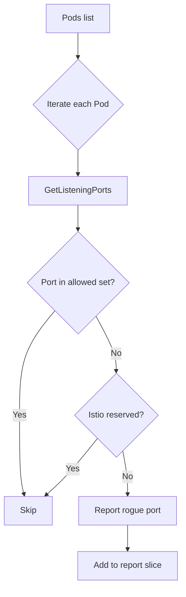

findRoguePodsListeningToPorts`

| Aspect | Detail |
|--------|--------|
| **Package** | `netcommons` – networking utilities for certsuite tests |
| **Signature** | `func findRoguePodsListeningToPorts(pods []*provider.Pod, ports map[int32]bool, ns string, log *log.Logger) []*testhelper.ReportObject` |
| **Exported?** | No – internal helper used by the test harness |

### Purpose

The function scans a list of Kubernetes pods (`pods`) and identifies any that expose TCP/UDP ports not declared in their container spec or reserved for Istio.  
For each offending pod it builds a `testhelper.ReportObject` describing:

* **Pod name** – which pod is misbehaving
* **Namespace** – the pod’s namespace (passed as `ns`)
* **Container(s)** – the containers that are listening on rogue ports
* **Port list** – the specific port numbers

These report objects are later used by higher‑level test functions to surface failures.

### Inputs

| Parameter | Type | Description |
|-----------|------|-------------|
| `pods` | `[]*provider.Pod` | All pods that belong to the namespace being checked. The provider type encapsulates pod metadata, status and container list. |
| `ports` | `map[int32]bool` | A lookup table of ports considered “allowed” (e.g., those declared by the test or reserved). The bool value is ignored – only the key matters. |
| `ns` | `string` | Namespace name for context in logs and report objects. |
| `log` | `*log.Logger` | Logger used for debugging; messages are emitted via `Info`, `Error`. |

### Core Logic

1. **Log start** – `log.Info("Finding rogue pods listening to ports")`.
2. **Find containers that declare the ports**  
   ```go
   rogueContainers := findRogueContainersDeclaringPorts(pods, ports)
   ```
   *Returns a map of pod → container that declares any port from `ports`.*

3. **Iterate over all pods** – for each pod:
   - Call `GetListeningPorts()` (method on the provider) to fetch all ports currently listening inside the pod.
   - Skip if the list is empty (`len(listeningPorts)==0`).
   - For each listening port, check if it is *not* in `ports` **and** not an Istio‑reserved port:
     ```go
     if !ports[port] && !ReservedIstioPorts.Contains(port) { … }
     ```
   - If such a rogue port exists:
     1. Log the discovery.
     2. Create a new report object via `testhelper.NewPodReportObject`.
     3. Populate it with:
        * pod name (`AddField("pod", pod.Name)`),
        * container(s) that declare the port (via `rogueContainers[pod]` or “unknown” if missing),
        * list of rogue ports as strings.
     4. Append to result slice.

4. **Return** – all generated report objects.

### Dependencies & Side‑Effects

| Dependency | Role |
|------------|------|
| `findRogueContainersDeclaringPorts` | Determines which containers already declare the “allowed” ports, used for context in the report. |
| `GetListeningPorts()` | From provider; introspects container processes to discover listening sockets. |
| `ReservedIstioPorts.Contains` | Checks against a global set of Istio‑reserved ports (`ReservedIstioPorts`). |
| `testhelper.NewPodReportObject`, `AddField`, `SetType` | Build structured test reports. |
| `log.Logger` | Emits informational and error logs; no state mutation beyond logging. |

### Package Context

Within the `netcommons` package, this helper supports higher‑level network tests that validate pod security posture by ensuring pods do not expose unintended ports. It is called from functions like `CheckNetworkPolicies`, which orchestrate comprehensive checks across namespaces.

### Suggested Mermaid Diagram



This diagram visualizes the decision path for detecting rogue ports.
