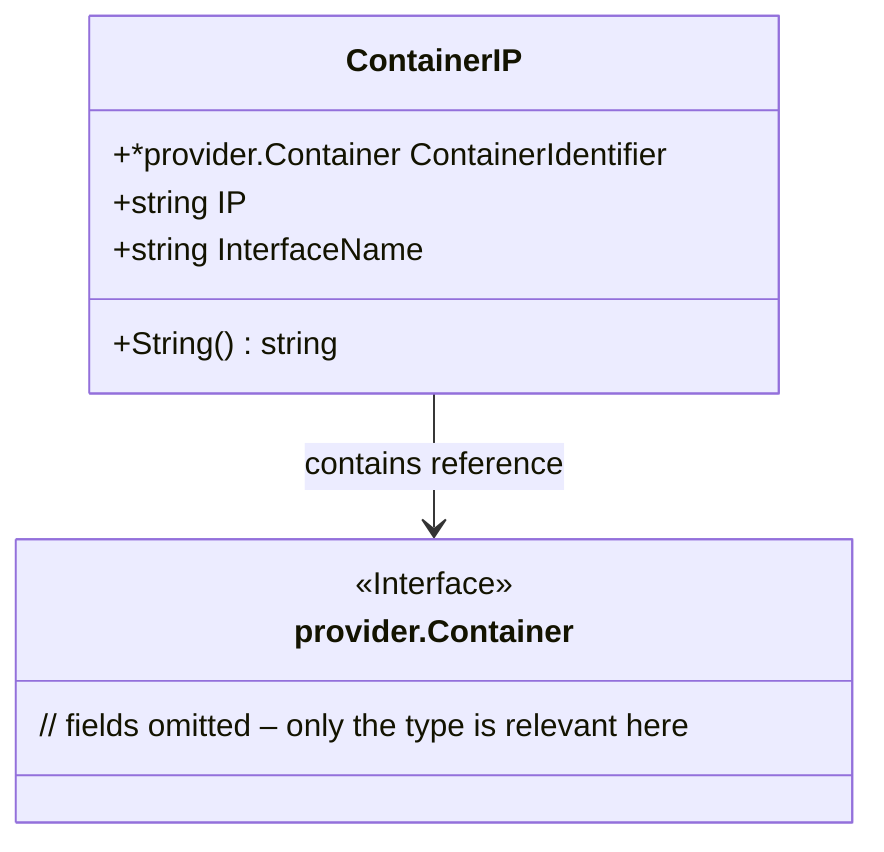

ContainerIP` – A lightweight container‑to‑IP mapping

| Aspect | Detail |
|--------|--------|
| **Package** | `github.com/redhat-best-practices-for-k8s/certsuite/tests/networking/netcommons` |
| **Purpose** | Stores a reference to a running container and the IP address assigned to it, together with the name of the network interface that received that IP.  This struct is used throughout the networking tests to keep track of which container has which address, and to provide readable diagnostics when tests fail. |

---

## Fields

| Field | Type | Description |
|-------|------|-------------|
| `ContainerIdentifier` | `*provider.Container` | A pointer to a *Provider*‑defined container object (from the test harness).  It uniquely identifies the container in the test environment. |
| `IP` | `string` | The IPv4 or IPv6 address that has been assigned to the container’s network interface. |
| `InterfaceName` | `string` | Name of the network interface inside the container that holds the IP (e.g., `"eth0"`). |

> **Note** – The struct does not perform any validation; it is a plain data holder.

---

## Methods

### `func (c ContainerIP) String() string`

* **Exported** – yes  
* **Signature** – `func()(string)`  
* **Behavior**  
  * Calls `fmt.Sprintf` to build a short, human‑readable representation of the container’s IP state.  
  * Internally uses the helper `StringLong`, which formats all fields in a multi‑line style (used only for debugging).  
* **Output Example**

```text
ContainerIP{ContainerIdentifier: <provider.Container>, IP: "10.1.2.3", InterfaceName: "eth0"}
```

> The method is used by the test suite’s loggers and error messages to quickly identify a container’s networking status.

---

## Dependencies & Side‑Effects

| Dependency | Role |
|------------|------|
| `fmt.Sprintf` | String formatting (no side effects). |
| `StringLong` | Helper that returns an extended string; only called within `String`. |

No global state is read or modified. The method is pure and safe for concurrent use.

---

## How It Fits the Package

* **Context** – In `netcommons`, containers are launched, network interfaces created, and IPs allocated as part of various networking tests (e.g., verifying pod-to-pod connectivity).  
* **Usage pattern** – After a container is started, its `provider.Container` instance and assigned IP are wrapped into a `ContainerIP`.  The slice of such structs is then passed to test helpers that perform reachability checks or generate diagnostic logs.  
* **Why the struct?** – It bundles together three pieces of information that always move together: the container identity, its address, and the interface name. This keeps the rest of the codebase cleaner and makes debugging easier.

---

## Suggested Mermaid Diagram



The diagram shows `ContainerIP` as a lightweight container for networking tests, referencing the underlying `provider.Container`.
