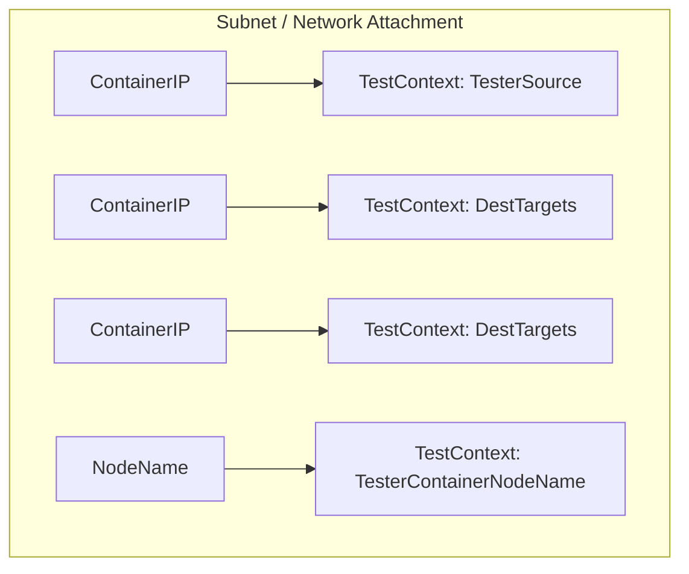

NetTestContext – Network‑Testing Metadata

| Element | Details |
|---------|---------|
| **Package** | `netcommons` (`github.com/redhat-best-practices-for-k8s/certsuite/tests/networking/netcommons`) |
| **Purpose** | Encapsulates all information required to run a network connectivity test (e.g. ping) for a particular subnet or *network attachment* in the CertSuite test harness. |

### Fields

| Field | Type | Meaning |
|-------|------|---------|
| `TesterSource` | `ContainerIP` | The IP address of the container that will initiate the test traffic.  It is chosen at random from the list of containers on the subnet; by convention it is the first element in the slice used to build this struct. |
| `DestTargets` | `[]ContainerIP` | A slice containing the IP addresses of every other container on the same subnet that should be pinged.  The tester will attempt to reach each of these targets. |
| `TesterContainerNodeName` | `string` | Kubernetes node name where the tester container is running. Useful for correlating test output with a specific host in distributed environments. |

> **Note** – `ContainerIP` is an alias defined elsewhere in the package; it represents a fully‑qualified IP address (e.g. `"10.1.2.3/24"`).

### Methods

#### `func (nc NetTestContext) String() string`

* **Signature**: `func()(string)`
* **Exported** – Yes.
* **Description**  
  Returns a human‑readable, multi‑line representation of the context.  
  The output is built using a `bytes.Buffer` and formatted with `fmt.Sprintf`. Typical content:

  ```
  TesterSource:     <IP>
  TesterContainerNodeName: <node-name>
  DestTargets (n):  <IP1>, <IP2>, ...
  ```

* **Side‑effects** – None. The method only reads the struct’s fields and writes to an in‑memory buffer.

#### `func PrintNetTestContextMap(m map[string]NetTestContext) string`

* **Signature**: `func(map[string]NetTestContext)(string)`
* **Exported** – Yes.
* **Description**  
  Accepts a map keyed by subnet identifier (e.g. `"net-att-1"`) to a `NetTestContext`.  
  Returns a formatted string that enumerates every entry in the map, each entry being rendered with the `String()` method of its value.

* **Side‑effects** – None. It is purely for logging/debugging purposes.

### Usage Flow

```
┌───────────────────────┐
│ Create list of Pods   │
├───────────────────────┤
│ Build ContainerIP     │
├───────────────────────┤
│ Pick random tester    │
├───────────────────────┤
│ Assemble NetTestContext│
├───────────────────────┤
│ Store in map[subnet]  │
└───────────────────────┘
```

* Each subnet (or network attachment) receives one `NetTestContext`.
* The test harness can iterate over the map, invoke `String()` for diagnostics,
  and launch ping commands from `TesterSource` to each address in `DestTargets`.

### Mermaid Diagram (suggested)



This diagram shows how a single subnet feeds into one `NetTestContext`, linking the tester’s IP, destination targets, and node name.

---

**In summary**, `NetTestContext` is a lightweight data holder that tells CertSuite *who* will send traffic and *to whom* it should go on a given network segment. Its methods provide convenient string representations for debugging or logging but do not alter any state. The struct fits naturally into the `netcommons` package, which aggregates networking test utilities used across the CertSuite test suite.
