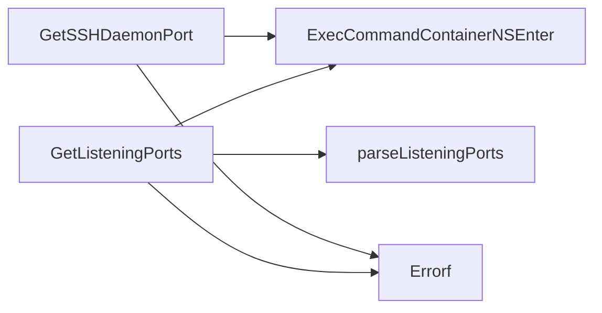

## Package netutil (github.com/redhat-best-practices-for-k8s/certsuite/tests/networking/netutil)

# `netutil` – Networking utilities for container tests

The **netutil** package provides helpers that run inside a test container and extract information about listening sockets.  
It is used by the networking tests in CertSuite to discover which ports are exposed by an image.

---

## Core data structure

| Name | Exported? | Fields |
|------|-----------|--------|
| `PortInfo` | ✅ | `PortNumber int32`, `Protocol string` |

`PortInfo` represents a single listening endpoint.  
The key of the map returned by the public helpers is a `PortInfo`; the value (`bool`) simply indicates that the port exists.

> **Why a map?**  
> The tests often need to check “is this port present?” – a map gives O(1) lookup and naturally handles duplicates.

---

## Key constants (private)

```go
const (
    getListeningPortsCmd = "ss -tuln" // command executed in the container

    indexPort     = 0 // column positions after splitting ss output
    indexProtocol = 1
    indexState    = 2

    portStateListen = "LISTEN"
)
```

* `getListeningPortsCmd` is the shell command that lists all listening sockets.  
* The *index* constants map to columns of the `ss -tuln` output: `Netid`, `Recv-Q`, `Send-Q`, `Local Address:Port`, `Peer Address`, `State`.  
  The code only cares about `Local Address:Port`, `Protocol` and `State`.  
* `portStateListen` is used to filter the output – only sockets in the LISTEN state are returned.

---

## Helper functions

### `parseListeningPorts`

```go
func parseListeningPorts(ssOutput string) (map[PortInfo]bool, error)
```

* **Input** – raw text from running `ss -tuln`.  
* **Processing** – splits by newlines → for each line:
  * trims the trailing “/tcp” or “/udp”.
  * splits on whitespace to get columns.
  * validates column count and that state is LISTEN.
  * extracts protocol (first column) and port number from `Local Address:Port`.
* **Return** – a map keyed by `PortInfo` with value `true`.  
* **Errors** – malformed lines or parse failures return an error.

### Public API

| Function | Signature | What it does |
|----------|-----------|--------------|
| `GetListeningPorts` | `func(*provider.Container)(map[PortInfo]bool, error)` | Executes `ss -tuln` inside the container (via `ExecCommandContainerNSEnter`) and parses the output. Returns a map of listening ports or an error. |
| `GetSSHDaemonPort` | `func(*provider.Container)(string, error)` | Runs `cat /etc/ssh/sshd_config | grep ^Port | awk '{print $2}'` inside the container to fetch the SSH daemon’s configured port. Returns it as a string or an error. |

Both functions use:

```go
ExecCommandContainerNSEnter(c, cmd) // runs command in container namespace
Errorf(...)                         // wraps errors with context
```

The `GetListeningPorts` function is the primary entry point for tests that need to verify exposed ports.

---

## How it all connects

1. **Test** → calls `GetListeningPorts(container)`  
2. **`GetListeningPorts`** runs `ss -tuln` in the container, receives raw output.  
3. The output is passed to `parseListeningPorts`.  
4. `parseListeningPorts` builds a map of `PortInfo{PortNumber, Protocol}` for each listening socket.  
5. Test can now query:  
   ```go
   ports, _ := netutil.GetListeningPorts(c)
   if _, ok := ports[netutil.PortInfo{22, "TCP"}]; !ok { /* fail */ }
   ```
6. **`GetSSHDaemonPort`** is used when tests need the exact port number configured in `sshd_config`.

---

## Mermaid diagram (suggestion)

```mermaid
flowchart TD
    Test -->|calls| GetListeningPorts
    GetListeningPorts -->|execs| ss -tuln
    ss -tuln --> ParseOutput
    ParseOutput -->|returns| portsMap
```

This package keeps all networking introspection logic in one place, making the test code cleaner and easier to maintain.

### Structs

- **PortInfo** (exported) — 2 fields, 0 methods

### Functions

- **GetListeningPorts** — func(*provider.Container)(map[PortInfo]bool, error)
- **GetSSHDaemonPort** — func(*provider.Container)(string, error)

### Call graph (exported symbols, partial)



### Symbol docs

- [struct PortInfo](symbols/struct_PortInfo.md)
- [function GetListeningPorts](symbols/function_GetListeningPorts.md)
- [function GetSSHDaemonPort](symbols/function_GetSSHDaemonPort.md)
