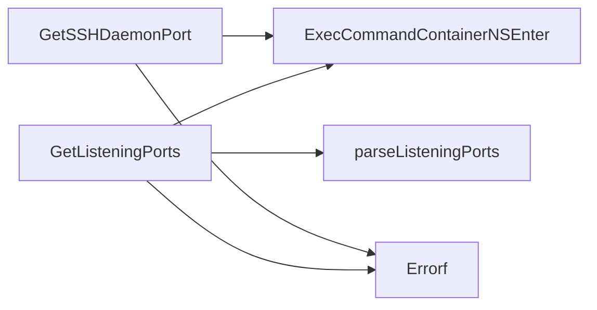

## Package netutil (github.com/redhat-best-practices-for-k8s/certsuite/tests/networking/netutil)

### Structs

- **PortInfo** (exported) — 2 fields, 0 methods

### Functions

- **GetListeningPorts** — func(*provider.Container)(map[PortInfo]bool, error)
- **GetSSHDaemonPort** — func(*provider.Container)(string, error)

### Call graph (exported symbols, partial)

### Symbol docs

- [struct PortInfo](symbols/struct_PortInfo.md)
- [function GetListeningPorts](symbols/function_GetListeningPorts.md)
- [function GetSSHDaemonPort](symbols/function_GetSSHDaemonPort.md)
