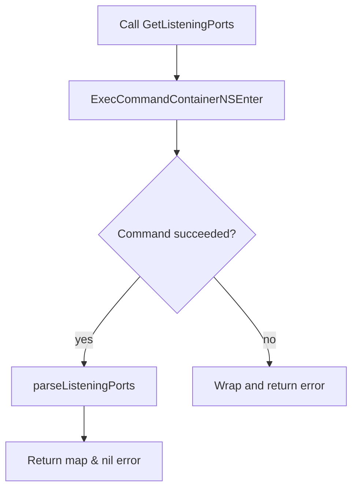

GetListeningPorts`

> **Purpose**  
>   Retrieves a map of listening ports inside a container.  
>   The key is a `PortInfo` value (a composite type that identifies a
>   port, its protocol and state), the value is a boolean that simply
>   indicates *presence* – it will always be `true`.  This structure can
>   be used to test whether expected ports are open or to compare two
>   containers for identical listening configurations.

### Signature

```go
func GetListeningPorts(c *provider.Container) (map[PortInfo]bool, error)
```

| Parameter | Type                     | Description |
|-----------|--------------------------|-------------|
| `c`       | `*provider.Container`    | The container to inspect. It must be running; the function will use
|           |                          | `ExecCommandContainerNSEnter` to execute commands inside it. |

| Return value | Type                | Description |
|--------------|---------------------|-------------|
| first        | `map[PortInfo]bool` | Map of listening ports found in the container.  The map keys are
|              |                     | `PortInfo` structs; values are always `true`. |
| second       | `error`             | Non‑nil if execution failed or parsing could not be performed. |

### Implementation details

1. **Command execution**  
   ```go
   stdout, err := ExecCommandContainerNSEnter(c, getListeningPortsCmd)
   ```
   * `getListeningPortsCmd` is a constant string (`"ss -tnlp")`
     that lists TCP sockets in the container via `ss`.  
   * `ExecCommandContainerNSEnter` runs this command inside the
     namespace of `c`.  If it fails, the error is wrapped with
     `Errorf`.

2. **Parsing**  
   ```go
   return parseListeningPorts(stdout)
   ```
   * The output of `ss -tnlp` is fed to `parseListeningPorts`, which
     converts each line into a `PortInfo`.  It returns a map where the
     key is the parsed `PortInfo` and the value is `true`.

3. **Error handling**  
   Any error from executing the command or parsing is returned; no
   side‑effects are performed on the container.

### Dependencies

| Dependency | Role |
|------------|------|
| `ExecCommandContainerNSEnter` | Executes a shell command in the container’s network namespace. |
| `Errorf` | Formats and wraps errors. |
| `parseListeningPorts` | Parses raw output of `ss` into structured data. |

### Package context

The `netutil` package provides utilities for introspecting networking
state inside containers used by Certsuite tests.  
`GetListeningPorts` is the public entry point that callers use to obtain
a quick snapshot of which TCP ports are listening, facilitating checks
such as “does this container expose port 443?” or “are both test and
real services listening on the same set of ports?”.



> **Note**: The function only inspects TCP listening sockets; UDP or
> other protocols are not considered.  If the container does not run an
> `ss` binary, the call will fail with a wrapped error.
