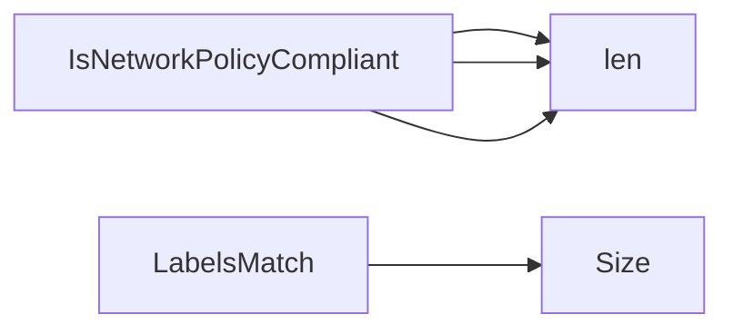

## Package policies (github.com/redhat-best-practices-for-k8s/certsuite/tests/networking/policies)

### Functions

- **IsNetworkPolicyCompliant** — func(*networkingv1.NetworkPolicy, networkingv1.PolicyType)(bool, string)
- **LabelsMatch** — func(v1.LabelSelector, map[string]string)(bool)

### Call graph (exported symbols, partial)

### Symbol docs

- [function IsNetworkPolicyCompliant](symbols/function_IsNetworkPolicyCompliant.md)
- [function LabelsMatch](symbols/function_LabelsMatch.md)
