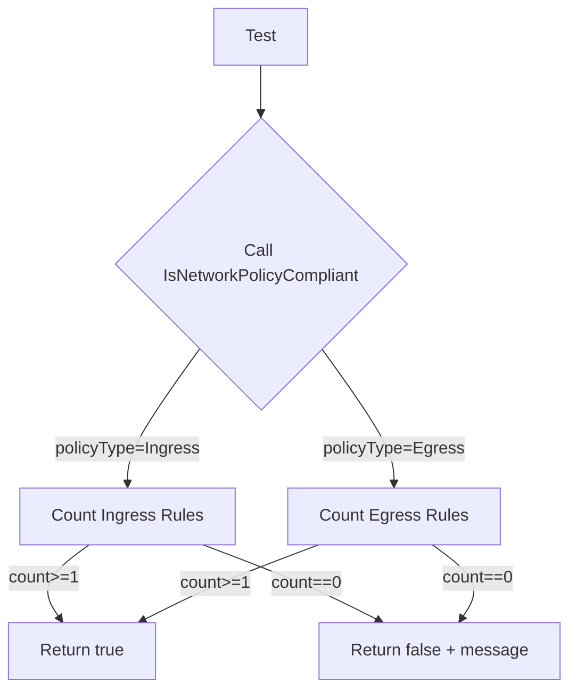
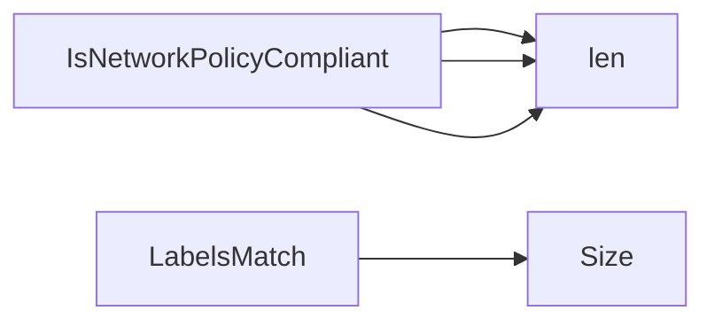

## Package policies (github.com/redhat-best-practices-for-k8s/certsuite/tests/networking/policies)

# Package Overview – `policies`

This package contains helper logic used in the Certsuite networking tests to determine whether a Kubernetes **NetworkPolicy** object satisfies the expected compliance rules.

| Item | Purpose |
|------|---------|
| **`IsNetworkPolicyCompliant`** | Primary public API. Accepts a pointer to a `networkingv1.NetworkPolicy` and a `networkingv1.PolicyType` (e.g., `Ingress`, `Egress`). Returns a boolean indicating compliance plus an explanatory string. |
| **`LabelsMatch`** | Utility that checks whether a given `LabelSelector` matches all labels in a supplied map. Used by tests to verify label‑based selectors within policies. |

## Core Data Flow

1. **Input** – A test provides a real or mock `NetworkPolicy` object and specifies which policy type it is testing (`Ingress`, `Egress`, or both).
2. **Processing** –  
   - `IsNetworkPolicyCompliant` counts the number of ingress/egress rules present in the spec.  
   - It compares those counts against expected values (the logic for “expected” is embedded as hard‑coded thresholds).  
   - If a mismatch occurs, it constructs an informative message and returns `false`; otherwise it returns `true`.
3. **Label Matching** – For selector validation, `LabelsMatch` receives a `v1.LabelSelector` from the policy spec and a map of labels (typically the pod’s own labels). It simply checks that every label required by the selector exists in the map.

## Function Signatures

```go
// IsNetworkPolicyCompliant evaluates a NetworkPolicy against minimal compliance rules.
// nolint:gocritic // unnamed results
func IsNetworkPolicyCompliant(policy *networkingv1.NetworkPolicy, policyType networkingv1.PolicyType) (bool, string)

// LabelsMatch returns true if all key/value pairs in the selector are present in labels.
func LabelsMatch(selector v1.LabelSelector, labels map[string]string) bool
```

### Implementation Highlights

- **`IsNetworkPolicyCompliant`**
  - Uses `len(policy.Spec.Ingress)` and `len(policy.Spec.Egress)` to count rules.
  - For a given `policyType`, it expects at least one rule of that type.  
  - Returns a string such as `"Ingress rule missing"` when non‑compliant.

- **`LabelsMatch`**
  - Calls `selector.MatchLabels.Size()` (from the Go `map` type) to get the number of required labels.
  - Iterates over those keys, checking presence in the supplied label map.

## Typical Usage Pattern

```go
policy := &networkingv1.NetworkPolicy{ /* populated elsewhere */ }
compliant, reason := policies.IsNetworkPolicyCompliant(policy, networkingv1.PolicyTypeIngress)
if !compliant {
    t.Fatalf("policy not compliant: %s", reason)
}
```

or for selector validation:

```go
matches := policies.LabelsMatch(policy.Spec.PodSelector, podLabels)
assert.True(t, matches, "pod labels do not match policy selector")
```

## Mermaid Diagram (Optional)



---

**Note:**  
- The package contains no global variables, constants, or additional types.  
- All logic is straightforward and self‑contained within the two exported functions.

### Functions

- **IsNetworkPolicyCompliant** — func(*networkingv1.NetworkPolicy, networkingv1.PolicyType)(bool, string)
- **LabelsMatch** — func(v1.LabelSelector, map[string]string)(bool)

### Call graph (exported symbols, partial)



### Symbol docs

- [function IsNetworkPolicyCompliant](symbols/function_IsNetworkPolicyCompliant.md)
- [function LabelsMatch](symbols/function_LabelsMatch.md)
