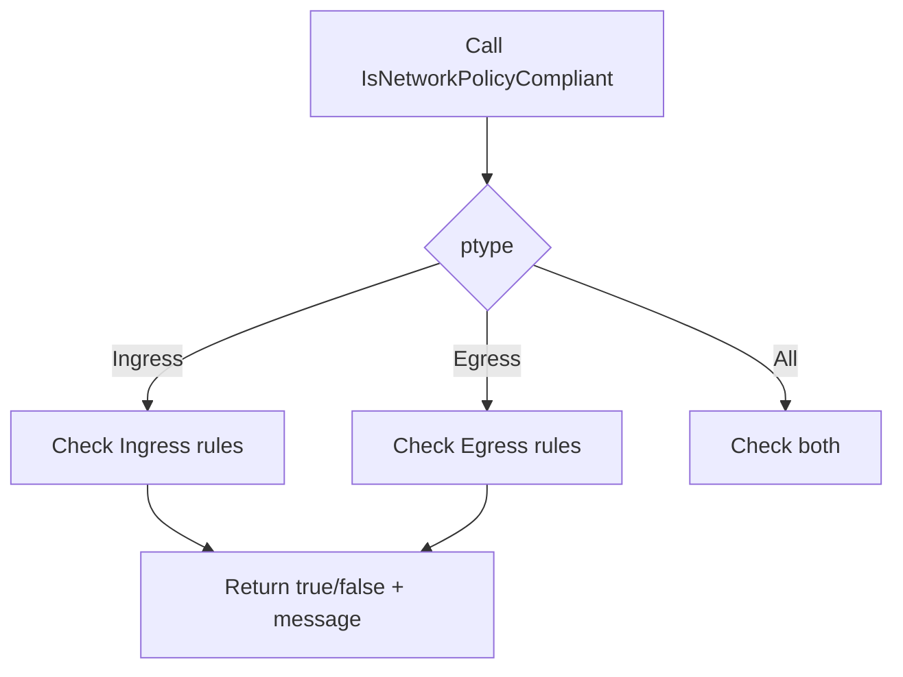

IsNetworkPolicyCompliant`

**Location**

`pkg: github.com/redhat-best-practices-for-k8s/certsuite/tests/networking/policies`
File: `policies.go` (line 25)

```go
func IsNetworkPolicyCompliant(policy *networkingv1.NetworkPolicy,
                               ptype networkingv1.PolicyType) (bool, string)
```

---

### Purpose

Determines whether a given Kubernetes `NetworkPolicy` satisfies the minimal requirements for a specific policy type (`Ingress`, `Egress`, or `All`).  
The function returns:

| Return value | Meaning |
|--------------|---------|
| `true`       | The policy meets all compliance checks for the requested type. |
| `false`      | At least one required field is missing or incorrectly configured. |
| `string`     | A human‑readable explanation of the first failure detected, empty when compliant. |

---

### Parameters

| Name   | Type                     | Description |
|--------|--------------------------|-------------|
| `policy` | `*networkingv1.NetworkPolicy` | The policy object to validate. It must not be `nil`; a `nil` value is treated as non‑compliant and triggers the error message “policy is nil”. |
| `ptype`  | `networkingv1.PolicyType`     | One of `Ingress`, `Egress`, or `All`. Determines which part of the policy to inspect. |

---

### Return Values

| Index | Type   | Description |
|-------|--------|-------------|
| 0     | `bool` | Compliance status (`true` if compliant). |
| 1     | `string` | Error message describing the first non‑compliant condition; empty when compliant. |

---

### Core Logic (simplified)

```go
// Ensure the policy object exists.
if policy == nil { return false, "policy is nil" }

// For Ingress or All: require at least one Ingress rule.
if ptype == networkingv1.PolicyTypeIngress || ptype == networkingv1.PolicyTypeAll {
    if len(policy.Spec.Ingress) == 0 { return false, "no ingress rules defined" }
}

// For Egress or All: require at least one Egress rule.
if ptype == networkingv1.PolicyTypeEgress || ptype == networkingv1.PolicyTypeAll {
    if len(policy.Spec.Egress) == 0 { return false, "no egress rules defined" }
}

// If we reach here, the policy satisfies the requested type.
return true, ""
```

The function relies only on Go’s built‑in `len` and the Kubernetes API types in `k8s.io/api/networking/v1`. No global state or side effects are involved.

---

### Dependencies

| Package | Reason |
|---------|--------|
| `k8s.io/api/networking/v1` | Provides `NetworkPolicy`, `PolicyType`, and rule slices. |

No other external packages or globals influence the function.

---

### How It Fits the Package

The `policies` package contains helper utilities for testing network policy compliance in CertSuite’s networking tests.  
`IsNetworkPolicyCompliant` is a small, reusable validator that:

1. **Normalizes** policy checks across multiple test cases.
2. Provides clear diagnostic messages to aid debugging.
3. Keeps the test logic focused on expectations rather than rule‑parsing boilerplate.

---

### Suggested Mermaid Diagram



This diagram visualises the decision flow based on `ptype`.
