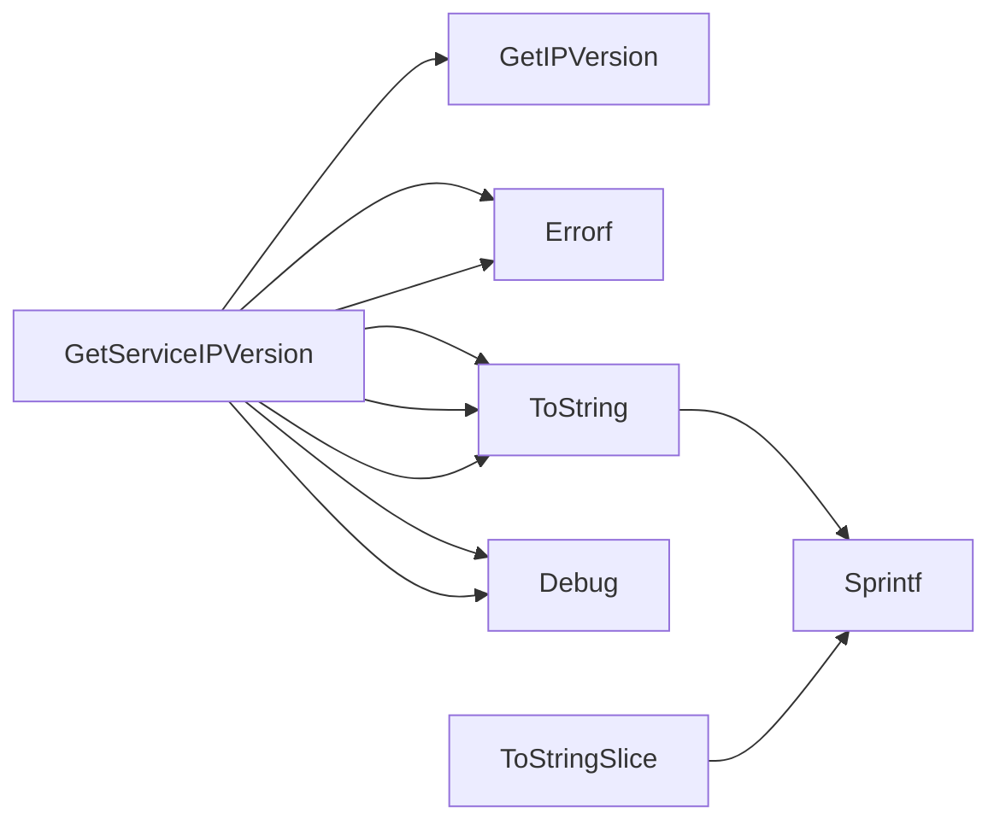

## Package services (github.com/redhat-best-practices-for-k8s/certsuite/tests/networking/services)

### Functions

- **GetServiceIPVersion** — func(*corev1.Service)(netcommons.IPVersion, error)
- **ToString** — func(*corev1.Service)(string)
- **ToStringSlice** — func([]*corev1.Service)(string)

### Call graph (exported symbols, partial)

### Symbol docs

- [function GetServiceIPVersion](symbols/function_GetServiceIPVersion.md)
- [function ToString](symbols/function_ToString.md)
- [function ToStringSlice](symbols/function_ToStringSlice.md)
