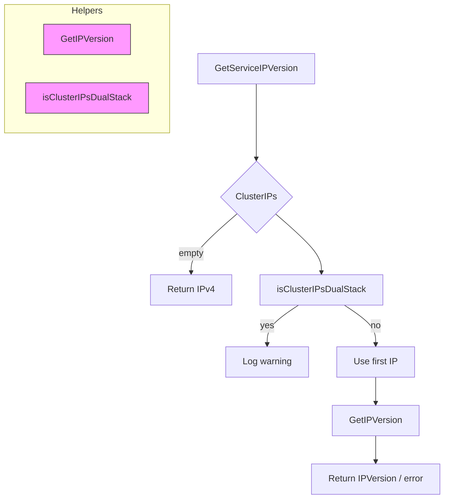
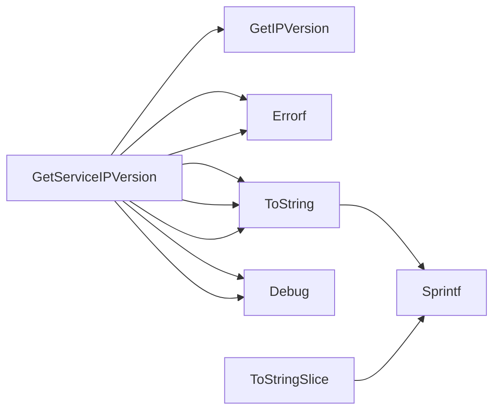

## Package services (github.com/redhat-best-practices-for-k8s/certsuite/tests/networking/services)

# Overview – `services` Package

The **`services`** package supplies helper utilities for working with Kubernetes `Service` objects in the Certsuite networking tests.  
It is intentionally lightweight: no exported structs or globals, only a handful of small functions that perform IP‑version detection and pretty printing.

| Exported API | Purpose |
|--------------|---------|
| `GetServiceIPVersion(*corev1.Service) (netcommons.IPVersion, error)` | Determines the *primary* IP protocol family used by a Service’s cluster IPs. |
| `ToString(*corev1.Service) string` | Human‑readable description of a single Service. |
| `ToStringSlice([]*corev1.Service) string` | Same as above but for a slice of Services. |

Internally it relies on two helpers:

* `GetIPVersion(string)` – defined in `netcommons`.  
  Returns `IPv4`, `IPv6`, or an error if the address is malformed.
* `isClusterIPsDualStack([]string) (bool, error)` – checks whether a Service’s `ClusterIP` and any entries in `ClusterIPs` use both IPv4 *and* IPv6.

---

## Function Flow

### 1. `GetServiceIPVersion`

```go
func GetServiceIPVersion(svc *corev1.Service) (netcommons.IPVersion, error)
```

| Step | What happens |
|------|--------------|
| **Extract IPs** | Reads `svc.Spec.ClusterIP` and any additional addresses in `svc.Spec.ClusterIPs`. |
| **Handle empty list** | If the slice is empty → return `IPv4` by default (common Kubernetes behaviour). |
| **Dual‑stack check** | Calls `isClusterIPsDualStack`. If true, logs a warning that the test expects a single IP family. |
| **Determine version** | Uses `GetIPVersion` on the first address to decide if it’s IPv4 or IPv6. |
| **Return** | The resolved `netcommons.IPVersion`, or an error when parsing fails. |

> **Why dual‑stack?**  
> Certsuite tests are written for a *single* IP family per Service. If a Service advertises both families, the test logs a debug message but still proceeds with the first address’s family.

### 2. `ToString`

```go
func ToString(svc *corev1.Service) string
```

Simply formats:

```
<Namespace>/<Name> (ClusterIP: <clusterIP>, ClusterIPs: [..], Ports: [...])
```

The function uses `fmt.Sprintf` for concise representation.

### 3. `ToStringSlice`

```go
func ToStringSlice(svcs []*corev1.Service) string
```

Iterates over the slice, calling `ToString` on each Service and concatenating the results with commas.

---

## Key Dependencies

| Dependency | Role |
|------------|------|
| `k8s.io/api/core/v1` | Provides the `Service` type. |
| `github.com/redhat-best-practices-for-k8s/certsuite/internal/log` | Structured logging (`Debug`, `Errorf`). |
| `github.com/redhat-best-practices-for-k8s/certsuite/tests/networking/netcommons` | IP‑family utilities and the `IPVersion` enum. |

---

## Suggested Mermaid Diagram



This diagram visualises the decision tree inside `GetServiceIPVersion`, showing how it interacts with its helper functions.

---

## Summary

The `services` package is a small, focused utility set that:

1. **Detects** which IP family (IPv4/IPv6) a Service primarily uses.
2. **Logs** potential dual‑stack misconfigurations in a test‑friendly way.
3. **Provides** readable string representations for debugging and reporting.

No state is held; all functions are pure except for the logging side‑effects, making them straightforward to unit‑test.

### Functions

- **GetServiceIPVersion** — func(*corev1.Service)(netcommons.IPVersion, error)
- **ToString** — func(*corev1.Service)(string)
- **ToStringSlice** — func([]*corev1.Service)(string)

### Call graph (exported symbols, partial)



### Symbol docs

- [function GetServiceIPVersion](symbols/function_GetServiceIPVersion.md)
- [function ToString](symbols/function_ToString.md)
- [function ToStringSlice](symbols/function_ToStringSlice.md)
