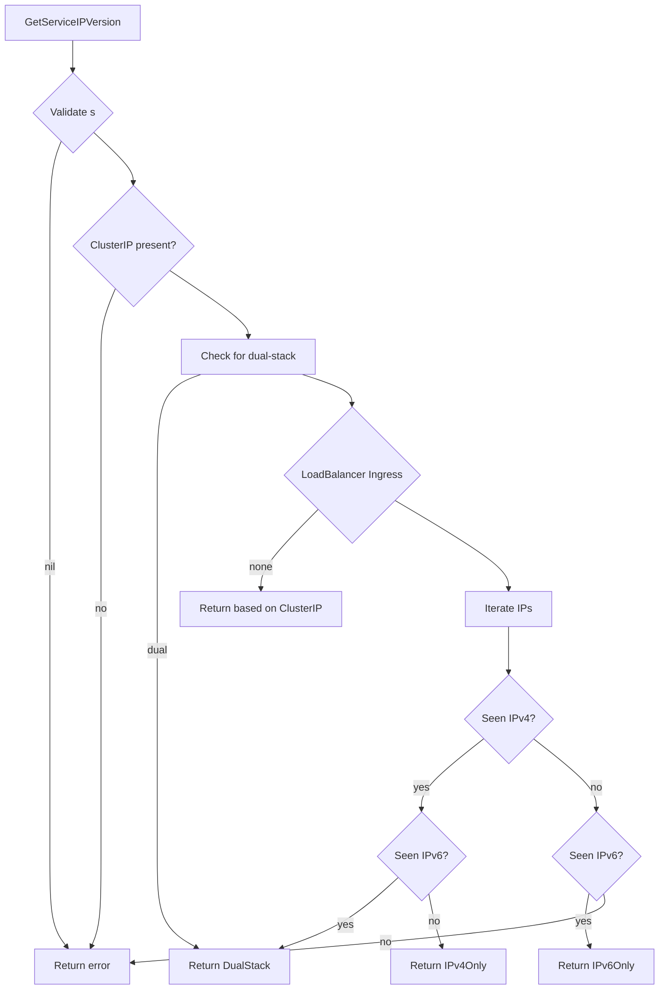

GetServiceIPVersion`

### Purpose
`GetServiceIPVersion` inspects a Kubernetes Service object and determines which IP version(s) the service exposes.  
The function returns one of the predefined constants from `netcommons.IPVersion`:

| Value | Meaning |
|-------|---------|
| `IPv4Only` | All addresses are IPv4 (no IPv6). |
| `IPv6Only` | All addresses are IPv6 (no IPv4). |
| `DualStack` | Service contains both an IPv4 and an IPv6 address. |

If the Service cannot be parsed or does not contain a valid IP address, the function returns an error.

### Signature
```go
func GetServiceIPVersion(s *corev1.Service) (netcommons.IPVersion, error)
```

* `s`: pointer to a `k8s.io/api/core/v1.Service` object.  
  The function expects this value to be non‑nil and fully populated by the caller.
* Returns:
  * `netcommons.IPVersion`: one of the three constants above.
  * `error`: non‑nil when the Service is malformed, missing required fields, or contains an unsupported IP format.

### Key Dependencies
| Dependency | Role |
|------------|------|
| `GetIPVersion` (internal helper) | Parses a single string into an `netcommons.IPVersion`. |
| `isClusterIPsDualStack` (internal helper) | Checks whether the Service’s ClusterIP field contains both IPv4 and IPv6 addresses. |
| Logging utilities (`Debug`, `Errorf`) | Emit debug or error messages; they do not alter state. |

### How It Works
1. **Early Validation**  
   * If `s` is nil → return error.  
2. **ClusterIP Analysis**  
   * Inspect the `s.Spec.ClusterIP` string:  
     * If empty → error (service must have a ClusterIP).  
     * If contains both IPv4 and IPv6 → `DualStack`.  
3. **LoadBalancer IPs**  
   * Iterate over `s.Status.LoadBalancer.Ingress`.  
     * For each entry, check its `IP` field:  
       * If empty or invalid → error.  
       * Track whether we see IPv4 or IPv6 addresses.  
     * After the loop:
       * If only IPv4 seen → `IPv4Only`.  
       * If only IPv6 seen → `IPv6Only`.  
       * If both types seen → `DualStack`.
4. **Fallback**  
   * If no LoadBalancer IPs are present, rely solely on ClusterIP analysis (step 2).  
5. **Return Result**  
   * Provide the determined `IPVersion` or an error if parsing failed.

### Side‑Effects
* The function performs only read operations on the Service object; it does not modify any fields.
* Logging calls may produce output to the configured logger but do not influence program state.

### Integration in Package
The `services` package contains utilities for working with Kubernetes Services during testing.  
`GetServiceIPVersion` is used by higher‑level tests that need to verify whether a Service behaves correctly under IPv4, IPv6, or dual‑stack networking scenarios.  
By abstracting the IP‑version logic into this helper, other test functions can focus on asserting behavior without duplicating parsing code.

### Example Usage
```go
svc := &corev1.Service{ /* populated elsewhere */ }
ipVer, err := services.GetServiceIPVersion(svc)
if err != nil {
    t.Fatalf("failed to determine IP version: %v", err)
}
switch ipVer {
case netcommons.IPv4Only:
    // expect IPv4‑only behavior
case netcommons.IPv6Only:
    // expect IPv6‑only behavior
case netcommons.DualStack:
    // expect dual‑stack support
}
```

--- 

**Mermaid Diagram (optional)**


