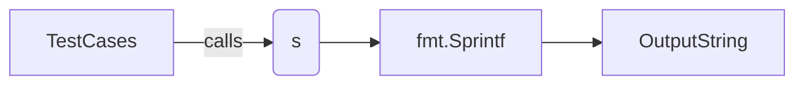

ToString` – Service pretty‑printer

| Aspect | Detail |
|--------|--------|
| **Package** | `github.com/redhat-best-practices-for-k8s/certsuite/tests/networking/services` |
| **Signature** | `func ToString(s *corev1.Service) string` |
| **Exported** | Yes |

### Purpose
`ToString` converts a Kubernetes `Service` object into a human‑readable representation.  
It is used in the test suite to log or display service details without exposing the full struct.

### Parameters
- `s *corev1.Service`: The Service instance to serialize.  
  - **Assumptions**: `s` is non‑nil; the function does not perform nil checks.
  - **Fields accessed** (directly or via formatting): 
    - `.Name`
    - `.Namespace`
    - `.Spec.ClusterIP`
    - `.Spec.Ports`

### Return Value
A single line string that contains a concise summary of the service.  
The format is produced by `fmt.Sprintf`, typically resembling:

```
"Service <namespace>/<name> (ClusterIP: <ip>) Ports: [<port>/TCP,...]"
```

(Exact formatting depends on the underlying implementation; see the source for specifics.)

### Key Dependencies
- **`fmt.Sprintf`** from Go’s standard library – used to compose the output string.
- **`corev1.Service`** from `k8s.io/api/core/v1` – the input type.

No other package functions or global variables are referenced.

### Side Effects & Constraints
- Pure function: it does not modify the passed `Service` object.
- No external state is accessed; therefore, the function is deterministic and safe for concurrent use.

### How It Fits the Package
Within the `services` test package, several helpers build or inspect Kubernetes Service objects.  
`ToString` provides a lightweight way to render those objects in logs or test failure messages, improving readability without pulling in full serialization logic (e.g., JSON marshaling).  

#### Suggested Mermaid Diagram



This illustrates the data flow: a test case passes a `Service` to `ToString`, which delegates string construction to `fmt.Sprintf`, producing the final output.
