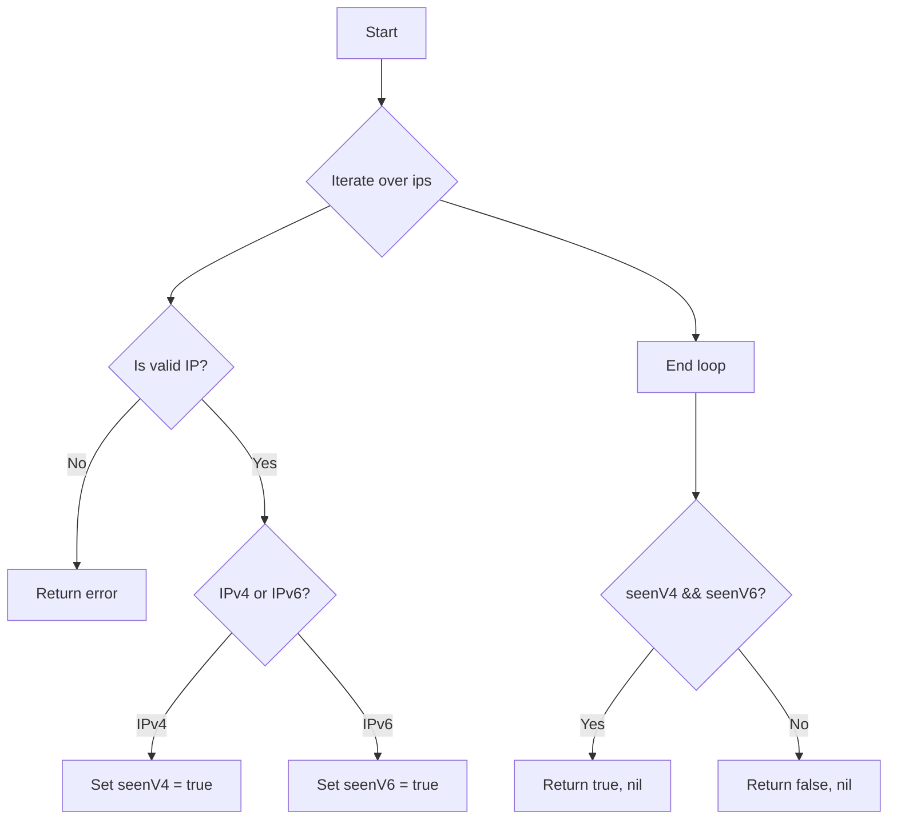

isClusterIPsDualStack`

### Purpose
`isClusterIPsDualStack` checks whether a set of cluster IP addresses contains **both** an IPv4 and an IPv6 address, i.e., whether the cluster is configured for dual‑stack networking.

> **Return values**
> * `true` – at least one IPv4 *and* at least one IPv6 address are present.
> * `false` – otherwise (only IPv4, only IPv6, or no addresses).
> * `error` – if any of the input strings cannot be parsed as an IP address.

### Signature
```go
func isClusterIPsDualStack(ips []string) (bool, error)
```

| Parameter | Type      | Description |
|-----------|-----------|-------------|
| `ips`     | `[]string` | Slice of cluster‑level IP addresses in string form. |

### Key Steps & Dependencies

1. **Iterate over each address**  
   For every element in `ips`, the function calls the helper `GetIPVersion`.  
   *`GetIPVersion`* parses a string into an `net.IP` and returns:
   - `4` if it is IPv4,
   - `6` if it is IPv6,
   - or an error if parsing fails.

2. **Track seen IP versions**  
   Two boolean flags (`seenV4`, `seenV6`) are set when a corresponding version is found.

3. **Early exit on error**  
   If any address cannot be parsed, the function immediately returns `false` and the wrapped error:
   ```go
   return false, Errorf("failed to parse cluster IP %q: %w", ipStr, err)
   ```
   (`Errorf` is a local helper that formats errors with context.)

4. **Result determination**  
   After processing all addresses, the function returns `seenV4 && seenV6`.  
   This expression is `true` only when both IPv4 and IPv6 addresses were encountered.

### Side Effects
- No global state is modified; the function is pure aside from error formatting.
- It may produce an error that includes the offending IP string for debugging purposes.

### Package Context
Within the **services** test package (`github.com/redhat-best-practices-for-k8s/certsuite/tests/networking/services`), this helper supports validation logic that verifies whether a Kubernetes cluster’s API server or other components are correctly configured for dual‑stack networking. It is used internally by tests that need to assert dual‑stack support before exercising related functionality.

---

#### Suggested Mermaid diagram (optional)



This diagram visualizes the decision flow of `isClusterIPsDualStack`.
