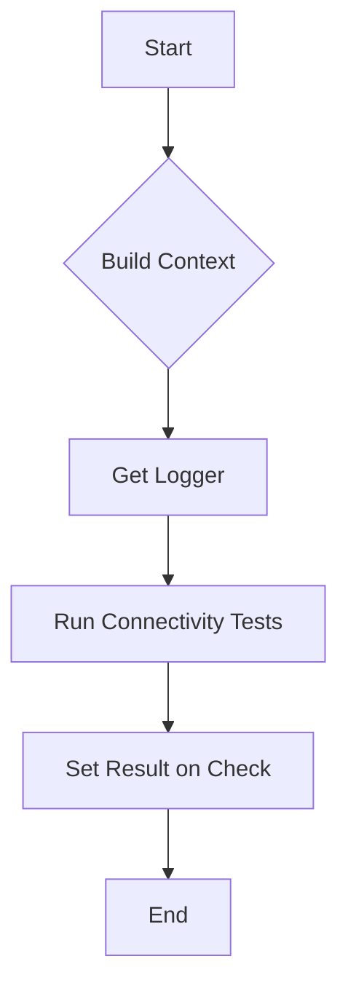

testNetworkConnectivity`

**Package:** `github.com/redhat-best-practices-for-k8s/certsuite/tests/networking`  
**File:** `suite.go:268`  
**Visibility:** unexported (used only inside the test suite)

### Purpose
Runs a connectivity check between the default network interfaces of all containers that are part of the current test environment.  
The function is intended to be used as a *sub‑test* closure passed to Ginkgo’s `It` or similar helpers.

### Signature
```go
func (*provider.TestEnvironment, netcommons.IPVersion, netcommons.IFType, *checksdb.Check)()
```
| Parameter | Type | Description |
|-----------|------|-------------|
| `env` | `*provider.TestEnvironment` | The test environment that holds the cluster state and helper utilities. |
| `ipVer` | `netcommons.IPVersion` | Target IP protocol version (IPv4/IPv6) for the connectivity tests. |
| `ifType` | `netcommons.IFType` | Interface type to test – e.g., *Container*, *Host* or *Pod*. |
| `check` | `*checksdb.Check` | Metadata about the check being executed (ID, description, severity). |

The function returns **no value**; it signals success/failure by setting the result on the supplied `Check`.

### Key Steps

1. **Context Creation**
   ```go
   ctx := BuildNetTestContext(env, ipVer, ifType)
   ```
   *`BuildNetTestContext`* assembles a test context that includes:
   - The target IP version.
   - The interface type to probe.
   - A list of all containers in the environment.

2. **Logging**
   ```go
   logger := GetLogger()
   logger.LogInfo("Running default network connectivity tests...")
   ```
   Logs the start of the test for visibility in CI output.

3. **Execution**
   ```go
   RunNetworkingTests(env, ctx)
   ```
   *`RunNetworkingTests`* iterates over every pair of containers in `ctx`, performing ping or similar probes from one to the other.  
   It populates the `Check.Result` field with a pass/fail status and an optional description.

4. **Result Reporting**
   ```go
   check.SetResult(...)
   ```
   The final result of the connectivity test is stored on the provided `Check` object so that it can be reported back to CertSuite’s results aggregator.

### Dependencies

| Called Function | What it does |
|-----------------|--------------|
| `BuildNetTestContext` | Builds a context containing containers and network settings. |
| `GetLogger` | Retrieves the global logger for structured output. |
| `RunNetworkingTests` | Performs the actual connectivity probes. |
| `SetResult` | Persists the outcome of the test in the `Check`. |

### Side Effects

- **Logging**: Emits informational logs during execution.
- **State Mutation**: Updates the passed `check.Result`; no other global state is altered.

### How It Fits the Package

The networking package orchestrates a suite of network‑related checks for CertSuite.  
`testNetworkConnectivity` is one of the core tests that verifies the *default* network path between containers, ensuring basic IP routing and firewall rules are correctly configured in the cluster.  
It is typically invoked from higher‑level test definitions (e.g., within `Describe` blocks) as part of a broader connectivity test matrix.

### Suggested Mermaid Flow



This diagram illustrates the linear progression of the test routine: context → logging → execution → result recording.
