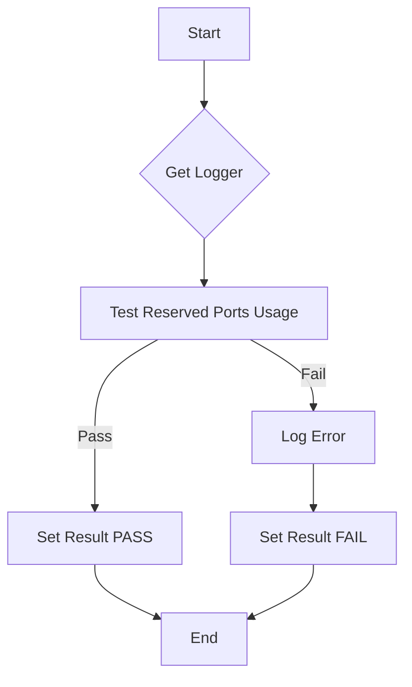

testPartnerSpecificTCPPorts`

| Aspect | Detail |
|--------|--------|
| **Package** | `networking` (github.com/redhat-best-practices-for-k8s/certsuite/tests/networking) |
| **Signature** | `func (*checksdb.Check, *provider.TestEnvironment)` |
| **Export status** | unexported |

### Purpose
Runs the **Partner‑Specific TCP Ports** test.  
The test verifies that a partner‑provided container image exposes only the TCP ports it declares in its manifest and that no additional ports are opened inadvertently.

> The function is invoked by the test runner (see `beforeEachFn`), which supplies a *Check* instance describing the test case and a *TestEnvironment* that holds the environment state for the current run.

### Inputs
| Parameter | Type | Role |
|-----------|------|------|
| `c` | `*checksdb.Check` | Holds metadata such as the test name, ID, and description. The function uses this to set result status via `SetResult`. |
| `env` | `*provider.TestEnvironment` | Contains environment data (e.g., logger, configuration). Used to obtain a logger with `GetLogger` and to call `TestReservedPortsUsage` for the actual port‑usage validation logic. |

### Key Operations
1. **Logging**  
   - Retrieves a logger instance: `logger := GetLogger(env)`.  
   - Uses it to log progress or errors.

2. **Port Usage Test**  
   - Calls the helper `TestReservedPortsUsage(logger, env)` which performs the actual port‑usage checks against the partner image’s container configuration.  

3. **Result Reporting**  
   - On success: `SetResult(c, "PASS")`.  
   - On failure (any error returned by `TestReservedPortsUsage`): logs the error and calls `SetResult(c, "FAIL")`.

### Side‑Effects
* Sets the result status on the provided `Check`.
* Emits log entries through the supplied logger.
* Does **not** modify global state or environment beyond reporting.

### Dependencies
- **`GetLogger(env)`** – provides a logging interface scoped to the test run.  
- **`TestReservedPortsUsage(logger, env)`** – encapsulates the logic that inspects container ports and compares them with partner‑declared values.  
- **`SetResult(c, string)`** – writes the final status back to the `Check`.

### Interaction with Package State
The function is part of a suite of networking tests. It relies on the package’s shared test environment (`env`) but does not touch any other global variables such as `beforeEachFn`. Its output (the result status) feeds into the overall test reporting infrastructure managed by `checksdb.Check`.

### Suggested Mermaid Flow Diagram

This function is a thin wrapper that orchestrates logging, execution of the core port‑usage logic, and result recording for the partner‑specific TCP ports test.
