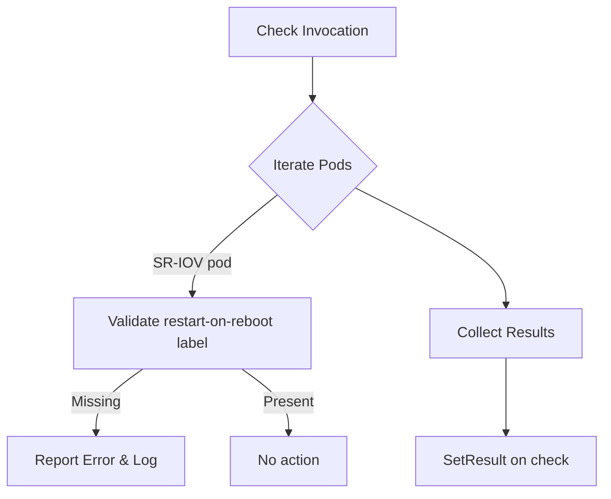

testRestartOnRebootLabelOnPodsUsingSriov`

**File:** `tests/networking/suite.go`  
**Package:** `networking` (internal test package)  

---

## Purpose

The function verifies that pods using SR‑IOV network interfaces correctly receive the **restart‑on‑reboot** label when the cluster restarts.  
It is a *check* implementation used by CertSuite’s networking tests to validate that the infrastructure automatically re‑installs or re‑configures SR‑IOV NICs after a node reboot.

---

## Signature

```go
func testRestartOnRebootLabelOnPodsUsingSriov(
    check *checksdb.Check,
    pods []*provider.Pod) func()
```

* **`check`** – The database record describing the test.  
  It is used to store results (`SetResult`) and may contain metadata such as description or severity.

* **`pods`** – A slice of pod objects returned by the test environment’s discovery step.  
  Each `provider.Pod` contains information about its labels, status, and associated node.

The function returns a closure that performs the actual verification when invoked by the test harness.

---

## Workflow

1. **Logging start**  
   ```go
   LogInfo("Testing restart on reboot label for SR‑IOV pods")
   ```

2. **Iterate over each pod**  
   For every `pod` in `pods`:
   * Retrieve all labels via `GetLabels(pod)`.
   * Check if the pod is an SR‑IOV consumer (label `"net.beta.kubernetes.io/network-attachment-definition"` contains a reference to an SR‑IOV network).

3. **Validate label presence**  
   * If the SR‑IOV pod lacks the expected `"restart-on-reboot=true"` label:
     * Append a failure report using `NewPodReportObject` and `Sprintf`.
     * Log the error with `LogError`.

4. **Collect results**  
   * A slice (`rebootLabelResults`) accumulates per‑pod reports.
   * After processing all pods, `check.SetResult(rebootLabelResults)` stores the aggregate outcome.

5. **Return** – The closure is returned to the caller; no side effects other than logging and result recording occur.

---

## Dependencies & Side Effects

| Dependency | Role |
|------------|------|
| `LogInfo` / `LogError` | Output diagnostic information to test logs. |
| `GetLabels` | Fetches pod labels from the Kubernetes API. |
| `NewPodReportObject` | Constructs a structured report for each pod, including status and message. |
| `Sprintf` | Formats human‑readable messages. |
| `SetResult` | Persists the test outcome in the check record. |

*No external state is modified other than the check’s result; the function has no visible side effects on pods or nodes.*

---

## Package Context

The **networking** test suite contains multiple checks that validate networking features (CNI, SR‑IOV, NetworkPolicies, etc.).  
`testRestartOnRebootLabelOnPodsUsingSriov` is part of a broader set of *restart* tests that ensure the cluster can recover network resources after node reboots.  

The function follows the same pattern as other checks:
```go
func <checkName>(check *checksdb.Check, pods []*provider.Pod) func() {
    return func() { /* test logic */ }
}
```
This design allows CertSuite to register the check and execute it asynchronously during a test run.

---

## Mermaid Diagram (Optional)



---

**Summary:**  
`testRestartOnRebootLabelOnPodsUsingSriov` ensures that SR‑IOV pods are correctly marked for automatic restart after a node reboot, recording any deviations and logging the process. It is a read‑only verification routine used within CertSuite’s networking test suite.
