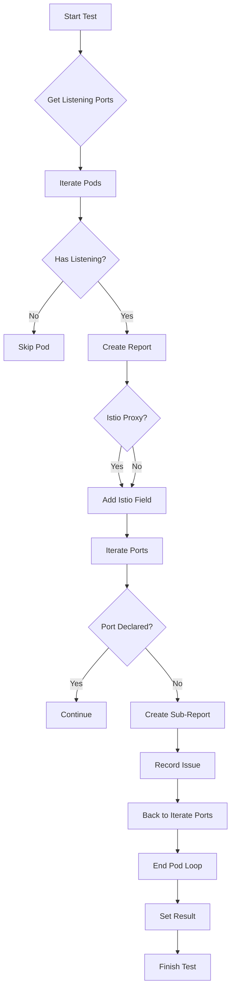

testUndeclaredContainerPortsUsage`

### Purpose
`testUndeclaredContainerPortsUsage` is a **private test helper** used by the networking suite to verify that pods in the cluster do not expose container ports that are not declared in their corresponding Kubernetes `PodSpec`.  
It iterates over all running pods, inspects each container’s listening sockets and compares them against the declared port list.  Pods that listen on undeclared ports generate a detailed report.

### Signature
```go
func testUndeclaredContainerPortsUsage(c *checksdb.Check, env *provider.TestEnvironment)
```
* `c` – The current check context from the checks database; used to record results.
* `env` – Test environment providing access to the cluster and helper utilities.

### Workflow

| Step | Action |
|------|--------|
| 1 | Log start of the test. |
| 2 | Retrieve all listening ports on every pod via `GetListeningPorts`. |
| 3 | For each pod: |
|   | • Build a report object (`NewPodReportObject`). |
|   | • If no listening ports → skip to next pod. |
|   | • Check if the pod contains an Istio proxy (`ContainsIstioProxy`) and record it in the report. |
|   | • For each listening port: |
|   | ‑ Verify that the port is present in the pod’s `PodSpec`. |
|   | ‑ If missing, create a sub‑report for that port with details (namespace, pod name, container, IP, etc.). |
| 4 | Aggregate all reports into `c.ReportObject`. |
| 5 | Set the final result (`SetResult`) to `Pass` if no undeclared ports were found; otherwise `Fail`. |

### Key Dependencies
* **Checks DB** – `checksdb.Check` is used for storing results.
* **Test Environment** – `provider.TestEnvironment` supplies:
  * Cluster client for pod discovery.
  * Utility functions (`GetListeningPorts`, `ContainsIstioProxy`).
* **Logging** – `LogInfo` and `LogError` provide diagnostic output.
* **Report helpers** – `NewPodReportObject`, `AddField`, `SetType`, `SetResult`.

### Side Effects
* Adds structured report objects to the check’s result set.
* Logs information about each inspected pod and any issues found.

### Package Context
Within the `networking` test suite, this function is part of a collection that validates network‑related best practices.  
It is invoked from a BDD‑style test case (likely using Ginkgo or similar) to enforce that container port exposure aligns with declared specifications, thereby preventing accidental service leakage.

---

#### Mermaid Diagram (suggested)



This diagram visualises the decision flow inside `testUndeclaredContainerPortsUsage`.
