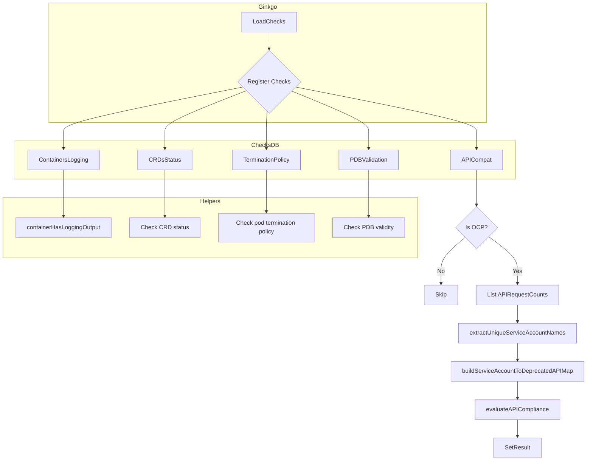
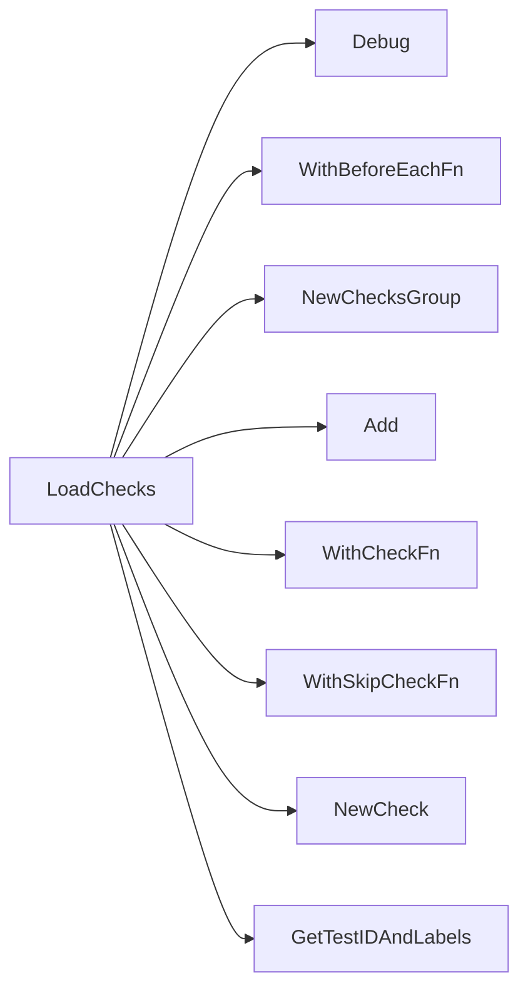

## Package observability (github.com/redhat-best-practices-for-k8s/certsuite/tests/observability)

# Observability Test Suite – High‑level Overview

The `github.com/redhat-best-practices-for-k8s/certsuite/tests/observability` package defines a set of functional checks that validate various observability‑related properties in a Kubernetes / OpenShift cluster.  
All logic lives inside **one file** (`suite.go`) and is driven by the **ChecksDB** infrastructure (see `pkg/checksdb`).  The tests are registered through the helper functions from `tests/common` and run via Ginkgo.

---

## Global state

| Variable | Type | Purpose |
|----------|------|---------|
| `env *provider.TestEnvironment` | holds the test environment (cluster client, namespace, etc.) | used by all checks to query cluster objects. |
| `beforeEachFn func()` | Ginkgo “BeforeEach” hook that is set up in `LoadChecks`.  It is executed before each check runs, allowing common pre‑processing. |

---

## Core workflow – `LoadChecks`

`LoadChecks` is the entry point invoked by the test harness.

1. **Logging** – prints debug information about the suite.
2. **Register BeforeEach** – sets `beforeEachFn` to a closure that creates a new `provider.TestEnvironment` instance per run (via `common.GetTestEnv()`).
3. **Create check groups** – several logical groups are added (`NewChecksGroup`).  
   Each group contains one or more checks created with `NewCheck`, configured with:
   - *ID* and *labels* via `GetTestIDAndLabels`
   - *Skip logic* (e.g., `GetNoContainersUnderTestSkipFn`)
   - *Check function* (`WithCheckFn`) – the actual test implementation.
4. **Add checks to DB** – `Add` attaches the check objects to the global ChecksDB so that Ginkgo can execute them.

The groups cover:
| Group | What it tests |
|-------|---------------|
| Containers logging | `testContainersLogging` |
| CRDs status sub‑resource | `testCrds` |
| Termination message policy | `testTerminationMessagePolicy` |
| Pod Disruption Budgets (PDBs) | `testPodDisruptionBudgets` |
| API compatibility with next OCP release | `testAPICompatibilityWithNextOCPRelease` |

---

## Individual test functions

All test functions share the same signature:

```go
func (*checksdb.Check, *provider.TestEnvironment)
```

They receive the check instance (for result reporting) and the environment.

### 1. `testContainersLogging`
*Iterates over all containers in all pods.*  
Calls helper `containerHasLoggingOutput` to see if any log line exists.  
If no logs → creates a container‑level report object with an error message; otherwise reports success.

### 2. `containerHasLoggingOutput`
Streams the last log line from a pod’s container (via client-go).  
Returns `true` if at least one line was read, `false` otherwise.  
Handles errors by propagating them to the caller.

### 3. `testCrds`
Queries all CRDs and checks whether each has a `status` sub‑resource (`subresources.status`).  
Reports success or lists missing ones as failures.

### 4. `testTerminationMessagePolicy`
Verifies that every pod in the namespace declares a termination message policy (e.g., `"File"`).  
Produces a container report for any pod lacking this field.

### 5. `testPodDisruptionBudgets`
For each PDB, validates:
* The selector matches at least one pod.
* The `minAvailable`/`maxUnavailable` values are valid and refer to existing pods.
If validation fails, reports detailed errors per PDB.

The helper functions from the local `pdb` package (`CheckPDBIsValid`) encapsulate the logic for validating a single PDB.

### 6. `testAPICompatibilityWithNextOCPRelease`
*Purpose*: Detect if any workload service account is still using an API that will be removed in the next OpenShift release.
Steps:
1. **Cluster type** – early exit if not OCP (`IsOCPCluster`).
2. **Collect API request counts** – list `apiserv1.APIRequestCount` objects via the apiserver v1 client.
3. **Extract service accounts** – call `extractUniqueServiceAccountNames(env)` to build a set of SA names that belong to workloads (from `env.ServiceAccounts`).
4. **Map deprecated APIs per SA** – `buildServiceAccountToDeprecatedAPIMap(counts, saSet)` creates:
   ```go
   map[serviceAccount]map[apiGroup/version]string // removedInRelease
   ```
5. **Evaluate compliance** – `evaluateAPICompliance(saToAPI, nextRelease, saSet)` compares the `removedInRelease` version with the *next* OCP release (calculated from current cluster version).  
   It returns a slice of `testhelper.ReportObject`s indicating either:
   * A compliant SA (`Status: "pass"`)
   * A non‑compliant SA (`Status: "fail"` + details).
6. **Set result** – attaches the report objects to the check.

---

## Supporting helpers

| Function | Role |
|----------|------|
| `buildServiceAccountToDeprecatedAPIMap` | Builds mapping from service accounts → APIs slated for removal. Filters on `removedInRelease != ""`. |
| `extractUniqueServiceAccountNames` | Pulls unique SA names from the environment’s workload list. |
| `evaluateAPICompliance` | For each SA, checks whether any deprecated API is still in use; generates report objects. |

---

## Data flow diagram (Mermaid)



---

## Summary

- **Global state**: `env` (test environment) and a Ginkgo `beforeEachFn`.
- **Entry point**: `LoadChecks` registers all checks in the DB.
- **Test logic** is split into small, focused functions that:
  - Query cluster objects via client-go.
 ‑ Inspect properties (logging, CRD status, pod policies, PDBs).
  - For API compatibility, gather apiserver metrics, map them to service accounts, and compare against the next OpenShift release version.
- **Reporting**: Each check produces `testhelper.ReportObject`s that are attached to the corresponding `*checksdb.Check`.  
- The suite is fully *read‑only* from a code‑invariant perspective; all functions perform side‑effectful cluster queries but do not modify cluster state.

### Functions

- **LoadChecks** — func()()

### Globals


### Call graph (exported symbols, partial)



### Symbol docs

- [function LoadChecks](symbols/function_LoadChecks.md)
