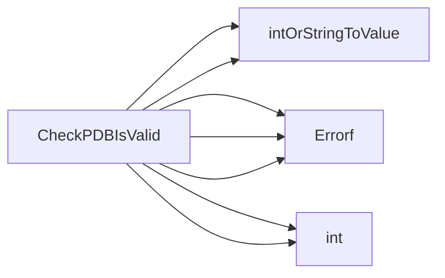

## Package pdb (github.com/redhat-best-practices-for-k8s/certsuite/tests/observability/pdb)

# Package Overview – `pdb`

The **`pdb`** package provides small helper utilities used by the CertSuite observability tests to validate Kubernetes PodDisruptionBudget (PDB) objects.  
It contains only three functions and a single constant, no exported types or global state.

---

## Constant

| Name              | Type  | Value | Purpose |
|-------------------|-------|-------|---------|
| `percentageDivisor` | `int32` | `100` | Used as the divisor when converting a percentage string (e.g., `"50%"`) into an integer count of pods.  

---

## Functions

### 1. `percentageToFloat`

```go
func percentageToFloat(s string) (float64, error)
```

* **Role** – Convert a string representing a percentage (like `"42%"` or `"100%"`) to a floating‑point number (`0.42`, `1.00`).  
* **Implementation** – Uses `fmt.Sscanf` to parse the numeric part and then divides by 100. Errors are returned if parsing fails or the value is out of range.  
* **Usage** – Only called internally by `intOrStringToValue`.  

---

### 2. `intOrStringToValue`

```go
func intOrStringToValue(v *intstr.IntOrString, totalPods int32) (int, error)
```

| Parameter | Type | Meaning |
|-----------|------|---------|
| `v` | `*intstr.IntOrString` | The PDB field (`MinAvailable`, `MaxUnavailable`) which can be an integer or a percentage string. |
| `totalPods` | `int32` | The total number of pods in the deployment, needed to compute a percentage value. |

* **Role** – Resolve an `IntOrString` into an absolute pod count.
  * If the field is an integer → return that value directly (after converting to `int`).
  * If it’s a string representing a percentage →  
    1. Parse the percentage with `percentageToFloat`.  
    2. Multiply by `totalPods`.  
    3. Round the result using `math.RoundToEven`.  

* **Error handling** – Any failure in parsing or conversion returns an error wrapped with context (`fmt.Errorf`).  

---

### 3. `CheckPDBIsValid`

```go
func CheckPDBIsValid(pdb *policyv1.PodDisruptionBudget, totalPods *int32) (bool, error)
```

| Parameter | Type | Meaning |
|-----------|------|---------|
| `pdb` | `*policyv1.PodDisruptionBudget` | The PDB object to validate. |
| `totalPods` | `*int32` | Optional pointer; if non‑nil the function uses it as the pod count for percentage calculations. |

* **Role** – Verify that a PDB’s constraints are logically consistent with the number of pods in the deployment.
  * For each field (`MinAvailable`, `MaxUnavailable`) present on the spec, call `intOrStringToValue` to obtain an absolute count.
  * The function ensures:
    * Both fields cannot be set simultaneously (Kubernetes forbids that).
    * The resulting counts are within `[0, totalPods]`.  
  * If any check fails, an error is returned; otherwise the function returns `true`.

* **Return values** –  
  * `bool` – `true` if the PDB passes all checks.  
  * `error` – Detailed failure reason (or `nil` on success).  

---

## How They Connect

```mermaid
flowchart TD
    A[User code] -->|passes PDB & pod count| B(CheckPDBIsValid)
    B --> C[intOrStringToValue]
    C --> D[percentageToFloat]   %% only when value is a percentage string
```

1. **`CheckPDBIsValid`** orchestrates the validation.  
2. It delegates numeric resolution to **`intOrStringToValue`**, which in turn may call **`percentageToFloat`** for percentages.  
3. Errors propagate back up, allowing callers to report precise problems.

---

## Summary

* The package contains **no exported types or globals**; it only exposes a single public validation function.
* Its logic is straightforward: parse `IntOrString` values (int or percentage), compute absolute pod counts, and ensure the PDB’s constraints are sensible for the given deployment size.  
* All heavy lifting is done by helper functions that convert and validate numeric representations safely.

This design keeps the validation concerns isolated from the rest of CertSuite, making it easy to test and reuse in other observability checks.

### Functions

- **CheckPDBIsValid** — func(*policyv1.PodDisruptionBudget, *int32)(bool, error)

### Call graph (exported symbols, partial)



### Symbol docs

- [function CheckPDBIsValid](symbols/function_CheckPDBIsValid.md)
