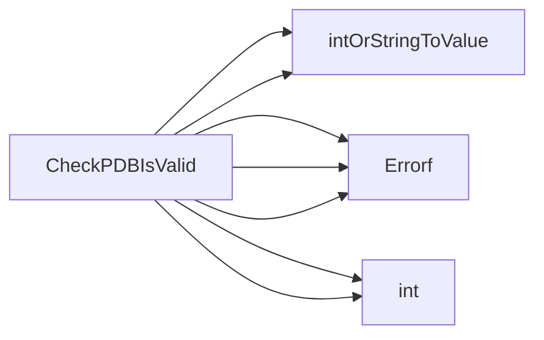

## Package pdb (github.com/redhat-best-practices-for-k8s/certsuite/tests/observability/pdb)

### Functions

- **CheckPDBIsValid** — func(*policyv1.PodDisruptionBudget, *int32)(bool, error)

### Call graph (exported symbols, partial)

### Symbol docs

- [function CheckPDBIsValid](symbols/function_CheckPDBIsValid.md)
