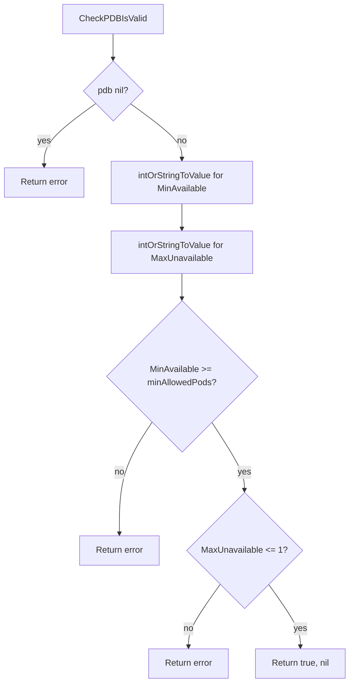

CheckPDBIsValid` – Validation helper for PodDisruptionBudgets  

### Purpose  
`CheckPDBIsValid` is a public helper that verifies whether a Kubernetes
`PodDisruptionBudget` (PDB) is **syntactically and semantically** valid in the context of CertSuite’s
observability tests.  
The function does *not* query a live cluster – it simply checks the fields of the supplied `policyv1.PodDisruptionBudget`
object against the expected ranges used by the test suite.

### Signature  

```go
func CheckPDBIsValid(pdb *policyv1.PodDisruptionBudget, minAllowedPods *int32) (bool, error)
```

| Parameter | Type | Meaning |
|-----------|------|---------|
| `pdb` | `*policyv1.PodDisruptionBudget` | The PDB to validate. Must not be nil. |
| `minAllowedPods` | `*int32` | Optional pointer to the *minimum number of pods that must stay up*.
If `nil`, a default value (computed from the PDB spec) is used. |

The function returns:

| Return value | Meaning |
|--------------|---------|
| `bool` | `true` if the PDB passes all checks; otherwise `false`. |
| `error` | Describes why validation failed, or `nil` on success. |

### How it works

1. **Early nil check**  
   If `pdb` is `nil`, an error is returned.

2. **Parse numeric values**  
   The helper `intOrStringToValue` converts the `MinAvailable` and `MaxUnavailable`
   fields (which are `*intstr.IntOrString`) into concrete integer values.
   It uses the package‑level constant `percentageDivisor = 100` to turn percentages
   into absolute numbers.

3. **Range checks**  
   * `minAvailable` must be greater than or equal to the value pointed to by
     `minAllowedPods`.  
   * `maxUnavailable` must not exceed a hard‑coded maximum (currently 1 in the tests).  

4. **Consistency check**  
   The function ensures that `MinAvailable` and `MaxUnavailable` are not set at the same time,
   mirroring Kubernetes’ own validation rules.

5. **Error reporting**  
   Whenever a rule is violated, an informative error message is produced via
   `fmt.Errorf`.  The first failing check aborts the function; subsequent checks
   are not evaluated.

### Dependencies

| Dependency | Role |
|------------|------|
| `policyv1` (Kubernetes API) | Provides the PDB struct definition. |
| `intOrStringToValue` | Converts `IntOrString` to an int. |
| `fmt.Errorf` | Builds error messages. |

The function has **no side effects**: it only reads from its arguments and returns
values; it does not modify the supplied PDB or any global state.

### Usage in the package

```go
valid, err := pdb.CheckPDBIsValid(pdbObj, &minPods)
if !valid {
    t.Fatalf("invalid PDB: %v", err)
}
```

The test suite calls this function before performing more elaborate checks on a PDB,
ensuring that only well‑formed budgets are processed further.

### Diagram (Mermaid)



This function is a lightweight gatekeeper that keeps the rest of the PDB‑related
tests focused on behaviour rather than plumbing.
