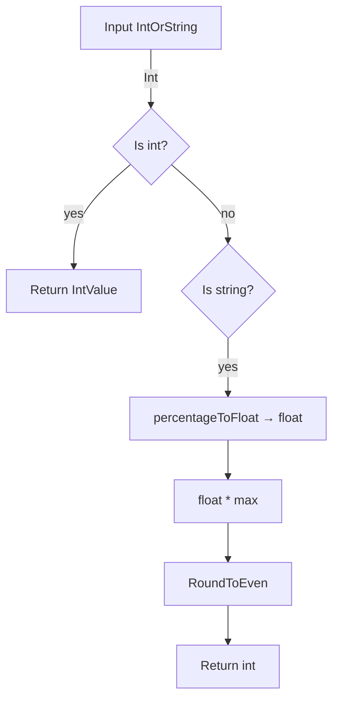

intOrStringToValue` – convert a Kubernetes `IntOrString` to an integer percentage

### Purpose
In the **pdb** package (Pod Disruption Budget tests) numeric thresholds can be expressed either as a raw integer or as a percent string (`"50%"`).  
`intOrStringToValue` normalises this input into an *integer* that represents the value in the same units that the rest of the test suite expects.

### Signature
```go
func intOrStringToValue(v *intstr.IntOrString, max int32) (int, error)
```
| Parameter | Type              | Description |
|-----------|-------------------|-------------|
| `v`       | `*intstr.IntOrString` | The value supplied by the test or a Kubernetes resource. It can be either an integer (`IntValue`) or a string percent (`"30%"`). |
| `max`     | `int32`           | The maximum allowable value (e.g., 100 for percentages). |

**Returns**

* `int` – the numeric representation of the input, bounded by `max`.
* `error` – non‑nil if the conversion fails or the value is out of bounds.

### How it works
1. **Integer path**  
   *If `v.Type == intstr.Int`:*  
   - Calls `IntValue()` to get the raw integer.
   - Validates that it does not exceed `max`.  
   - Returns the integer directly or an error if too large.

2. **Percent string path**  
   *If `v.Type == intstr.String`:*  
   - Parses the percent string via `percentageToFloat`, which strips the trailing `%` and converts to a float in `[0,1]`.  
   - Multiplies by `max` (`percentageDivisor = 100`) to scale it back to the original units.  
   - Rounds the result to the nearest even integer using `math.RoundToEven`.  
   - Returns the rounded value.

3. **Error handling** – Any parsing or bounds violation triggers an error formatted with `fmt.Errorf`.

### Dependencies
| Dependency | Role |
|------------|------|
| `intstr.IntOrString` (k8s) | Input type that can hold either an int or a string percent. |
| `percentageToFloat` | Helper to convert `"NN%"` → `float64`. |
| `math.RoundToEven` | Rounds the computed float to nearest integer, avoiding bias. |
| `fmt.Errorf` | Formats error messages. |

### Side effects
None beyond returning values; the function is pure.

### Package context
The **pdb** package implements tests for Kubernetes Pod Disruption Budgets.  
Many test scenarios involve comparing configured thresholds (e.g., minAvailable) against expected integer values. This helper ensures that whether a threshold is specified as an absolute number or a percentage, it can be compared consistently across the test suite.



---
