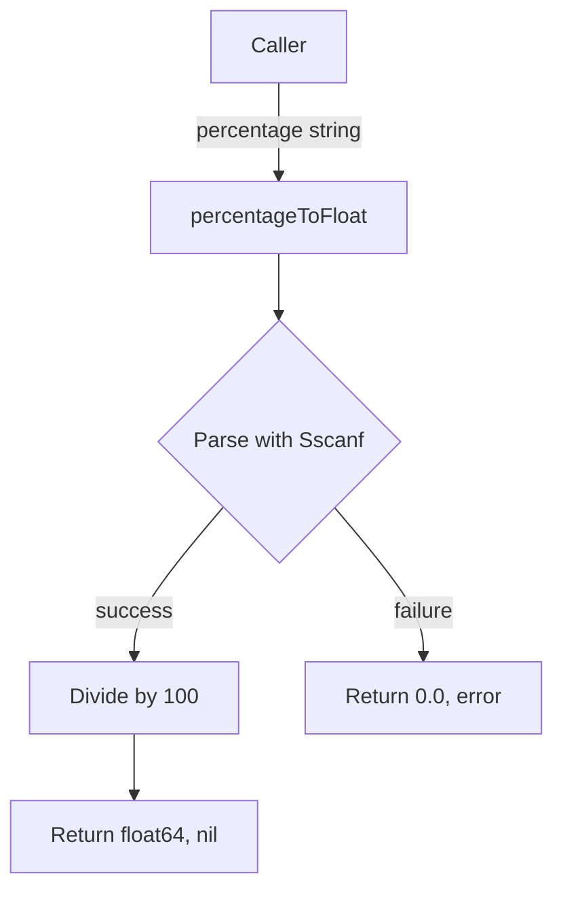

percentageToFloat` – Convert a percentage string into a numeric value

| Aspect | Details |
|--------|---------|
| **Package** | `pdb` (github.com/redhat-best-practices-for-k8s/certsuite/tests/observability/pdb) |
| **Signature** | `func percentageToFloat(s string) (float64, error)` |
| **Visibility** | Unexported – used only within the `pdb` package. |

### Purpose
The function translates a human‑readable percentage representation (e.g., `"25%"`, `"75"`) into its numeric float form (`0.25`, `0.75`).  
It is typically called by tests or helpers that need to interpret configuration values expressed as percentages.

### Parameters
| Name | Type | Description |
|------|------|-------------|
| `s`  | `string` | The raw percentage text supplied by the caller. |

### Returns
| Value | Type | Meaning |
|-------|------|---------|
| first return | `float64` | The parsed value divided by `percentageDivisor` (100). For `"50%"`, it returns `0.5`. |
| second return | `error` | Non‑nil if the input cannot be parsed as a number or if the format is invalid. |

### Core Logic
1. **Parse numeric part** – Uses `fmt.Sscanf(s, "%f", &val)` to extract a floating‑point number from the string.
2. **Scale** – Divides the parsed value by the package‑level constant `percentageDivisor` (value = 100) to convert a percentage into a unitless fraction.
3. **Error handling** – If parsing fails or the string contains no numeric data, an error is returned.

### Dependencies
- `fmt.Sscanf` from the standard library for parsing.
- Constant `percentageDivisor`, defined in the same file (`pdb.go`) at line 12 as `const percentageDivisor = 100`.

### Side‑Effects & Constraints
- No global state is modified; the function is pure apart from reading a constant.
- It assumes that any non‑numeric characters after the number (e.g., a trailing `%`) are ignored by `Sscanf`.  
  If strict format checking is needed, callers should validate before invoking.

### Package Context
Within the `pdb` test package, percentage strings often appear in configuration files or command line flags.  
`percentageToFloat` abstracts the conversion logic so that test helpers can work with numeric thresholds without duplicating parsing code.

---

**Note:** The function is intentionally unexported because its use is confined to the internal test logic of the `pdb` package.
