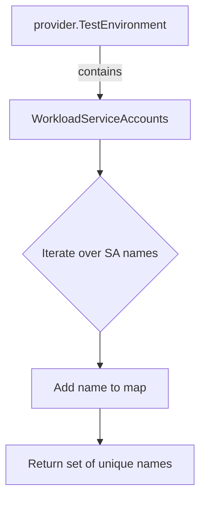

extractUniqueServiceAccountNames`

| Item | Details |
|------|---------|
| **Package** | `github.com/redhat-best-practices-for-k8s/certsuite/tests/observability` |
| **Visibility** | Unexported (`private`) – used only within the test suite. |
| **Signature** | `func(*provider.TestEnvironment) map[string]struct{}` |

### Purpose
`extractUniqueServiceAccountNames` scans a `TestEnvironment` instance for all workload‑related ServiceAccounts and returns a set of their names.  
The function is called from the observability test suite (see `suite.go:384`) to gather a unique collection of ServiceAccount names that will be referenced later in tests.

### Parameters
| Parameter | Type | Description |
|-----------|------|-------------|
| `env` | `*provider.TestEnvironment` | The test environment object holding information about deployed workloads, including their associated ServiceAccounts. |

> **Note**: `provider.TestEnvironment` is defined elsewhere in the repository; its structure contains a field that lists workload ServiceAccounts.

### Return Value
- `map[string]struct{}` – A map used as a set where each key is a unique ServiceAccount name and the value is an empty struct to keep memory usage minimal.  
  The map’s keys are returned; values are ignored by callers.

### Key Operations & Dependencies
1. **Map Creation**: Uses `make(map[string]struct{})` to initialise the result set.
2. **Iteration**: Loops over `env.WorkloadServiceAccounts` (or equivalent field) – the exact field name is inferred from usage patterns in the test suite.
3. **Uniqueness Enforcement**: Each encountered ServiceAccount name is inserted into the map; duplicate names are naturally discarded because keys in a Go map are unique.

### Side Effects
- None. The function performs read‑only operations on `env`; it does not modify any global state or mutate the input environment.

### Integration in the Package
`extractUniqueServiceAccountNames` is part of the test infrastructure for the *observability* package.  
It is invoked during test setup (likely inside a `BeforeEach` hook) to prepare a set of ServiceAccounts that will be used by subsequent test cases to verify observability metrics, logs, or security policies.

### Suggested Mermaid Diagram

> The diagram illustrates how the function consumes a `TestEnvironment`, extracts ServiceAccount names, and produces a unique set.
