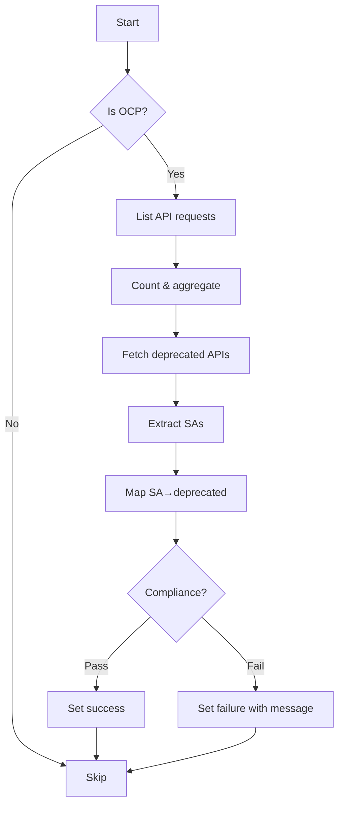

testAPICompatibilityWithNextOCPRelease`

| Aspect | Detail |
|--------|--------|
| **Package** | `github.com/redhat-best-practices-for-k8s/certsuite/tests/observability` |
| **Signature** | `func(test *checksdb.Check, env *provider.TestEnvironment)` |
| **Exported?** | No – used only inside the test suite. |

---

### Purpose
Runs a regression‑style check that verifies whether an OpenShift cluster is still compatible with the API surface of the next major OCP release.

* It compares the set of API requests recorded on the current cluster against the list of deprecated or removed APIs in the upcoming release.
* The result is stored back into the provided `checksdb.Check` record.

---

### Inputs

| Parameter | Type | Role |
|-----------|------|------|
| `test` | `*checksdb.Check` | Database record that will receive the test outcome. |
| `env` | `*provider.TestEnvironment` | Holds all runtime information (cluster config, client factory, etc.) needed to interact with the target cluster. |

---

### Key Steps & Dependencies

1. **Cluster type guard**  
   ```go
   if !IsOCPCluster(env) { … }
   ```
   * Skips test on non‑OpenShift clusters.

2. **Logging** – `LogInfo` is used to trace progress (e.g., “Fetching API request counts”).

3. **Collecting metrics**  
   * `GetClientsHolder(env)` → `List()` retrieves the current list of API requests from the cluster.  
   * `APIRequestCounts(...)` processes those raw entries into a map keyed by API verb+resource.

4. **Deprecated‑API lookup**  
   * Calls `ApiserverV1()` to obtain the next OCP release’s deprecated API definitions (likely via an external service or cached file).

5. **Service‑account extraction**  
   ```go
   extractUniqueServiceAccountNames(apiRequestCounts)
   ```
   Builds a set of SA names that performed the requests.

6. **Mapping SAs → deprecated APIs**  
   `buildServiceAccountToDeprecatedAPIMap()` correlates each service account with the deprecated endpoints it used.

7. **Evaluation**  
   ```go
   evaluateAPICompliance(saDepMap)
   ```
   Determines whether any SA made calls to removed/deprecated APIs, returning a boolean and an optional message.

8. **Result persistence**  
   `SetResult(test, success, message)` writes the pass/fail status back to the database record.

---

### Side Effects

* Reads cluster metrics; no mutation of the cluster itself.
* Writes only to the supplied `checksdb.Check` object (and consequently to its underlying DB).
* Uses global logger (`LogInfo`, `LogError`) for diagnostics.

---

### How It Fits the Package

The `observability` package implements a suite of runtime checks that validate the health and compliance of a cluster.  
`testAPICompatibilityWithNextOCPRelease` is one such check, specifically targeting future‑proofing against upcoming OpenShift releases.  
It is typically invoked by the test harness in `suite.go` during the `Run()` phase.

---

### Suggested Mermaid Flow



---
