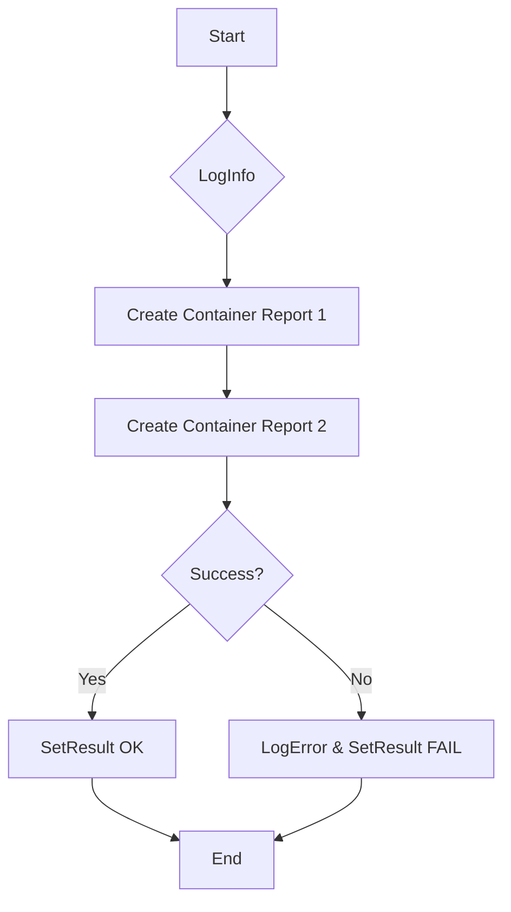

testTerminationMessagePolicy`

**File:** `tests/observability/suite.go`  
**Line:** 177

### Purpose
`testTerminationMessagePolicy` validates that a pod’s termination message is correctly captured and reported in the generated container report objects. It is part of the test suite for the *Observability* package, ensuring that when a pod terminates, its exit logs are stored as expected.

> **Note:** The function is intentionally unexported because it is only used internally by the test harness.

### Signature
```go
func testTerminationMessagePolicy(check *checksdb.Check, env *provider.TestEnvironment)
```

| Parameter | Type                           | Description |
|-----------|--------------------------------|-------------|
| `check`   | `*checksdb.Check`              | The database check record that will be updated with the result of this test. |
| `env`     | `*provider.TestEnvironment`    | Test environment context containing utilities such as logging and configuration helpers. |

The function does **not** return a value; it mutates `check.Result` to indicate pass/fail status.

### Key Steps & Dependencies

1. **Logging Setup**
   - Calls `env.LogInfo()` at the start and end for traceability.
   - Uses `env.LogError()` if any error occurs during report creation.

2. **Report Generation**
   - Invokes `NewContainerReportObject` twice, once for each of two simulated containers that are expected to produce termination messages.
   - Each call appends a new container report object to the test’s internal slice (via `append`).

3. **Result Assignment**
   - After both reports are created successfully, `check.SetResult()` is called with an *OK* status (`checksdb.CheckStatusOK`).  
   - If any step fails, `SetResult` receives a failure status and an error message.

4. **Global Variables Used**
   - `env`: the current test environment instance (declared at line 43).  
   - No other globals are accessed.

### Side Effects

- **State Mutation**: Modifies `check.Result`, thereby affecting the database record that will be persisted after tests finish.
- **Logging**: Emits informational and error messages to the test logs via `env`.

### How It Fits the Package

`testTerminationMessagePolicy` is one of several helper functions in `suite.go` that collectively validate Kubernetes observability features.  
The function:

- Works with the *checks* database layer (`checksdb.Check`) to record test outcomes.
- Leverages the *provider* package’s `TestEnvironment` for shared utilities such as logging and configuration handling.
- Forms part of a larger suite that runs during integration tests, ensuring that termination messages are correctly handled by the observability agent.

---

#### Suggested Mermaid Diagram



This diagram visualizes the control flow of `testTerminationMessagePolicy`.
